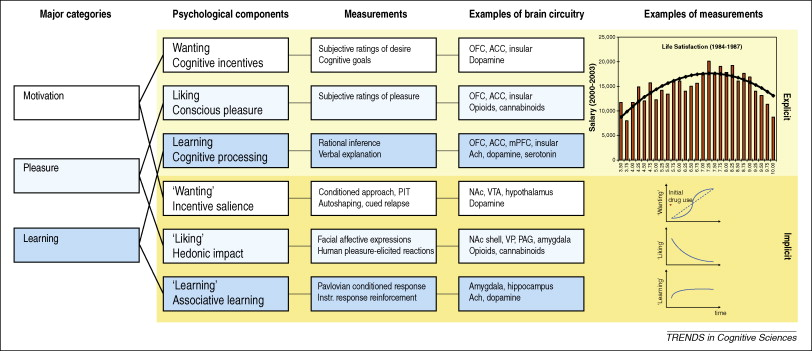

## I Second That Emotion

<iframe width="420" height="315" src="https://www.youtube.com/embed/KI_0tQdEA5k" frameborder="0" allowfullscreen></iframe>

## Happiness Is...

<iframe width="420" height="315" src="https://www.youtube.com/embed/5eHWHjRPNV0" frameborder="0" allowfullscreen></iframe>

## Today's Topics

- Biology of Emotion

## Biology of Emotion

- What is emotion?
- What are the types of emotions?
- Biological systems involved in emotion

## What is emotion?

- Feelings
- Physiological state
- Actions
- Propensity to act

## What are the types of emotions?

[[@plutchik1980emotion]](img/plutchik-wheel-emotion.png)

## Emotions

- Vary in valence
    + Positive/negative
- Vary in intensity (arousal)
- Vary in action tendency
    + Approach/avoid
- Serve biological goals

## Biological goals

- Ingestion
- Defense
- Reproduction

- Affiliation

## Plutchik

<http://puix.org/wp-content/uploads/plutchik-wheel-emotion.png>
[[@plutchik1980emotion]](img/plutchik-wheel-emotion.png)

## Do *all* emotions serve biological goals?

- Shame
- Guilt
- Pride
- Embarrassment
- Regret

## Are 'social' goals biological?

## Emotional "computing"

- Input
- Processing/evaluation
- Output

## Emotional "computing"

- **Input**
- Processing/evaluation
- Output

## Emotional "computing"

- Input
    + External
    + Internal
    
## Emotional "computing"

- Input
- **Processing/evaluation**

## Emotional "computing"

- Input
- Processing/evaluation
    + Current state + past states (memory)
    + Food/non
    + Threat/non
    + Mate/non; offspring/non

## Emotional "computing"

- Input
- Processing/evaluation
- **Output**

## Emotional "computing"

- Output
    + Physiological state
        * Autonomic nervous system
        * Hormones

## Emotional "computing"

- Output
    + Actions
        * Facial expression
        * Vocalization
        * Gestures, body posture
        * Locomotion or freezing
      
## Bodily maps of emotions

[[@nummenmaa2014bodily]](http://dx.doi.org/10.1073/pnas.1321664111)

[[@nummenmaa2014bodily]](http://dx.doi.org/10.1073/pnas.1321664111)

## [[@nummenmaa2014bodily]](http://dx.doi.org/10.1073/pnas.1321664111)

[[@nummenmaa2014bodily]](http://dx.doi.org/10.1073/pnas.1321664111)

## [[@nummenmaa2014bodily]](http://dx.doi.org/10.1073/pnas.1321664111)

>> *We propose that emotions are represented in the somatosensory system as culturally universal categorical somatotopic maps. Perception of these emotion-triggered bodily changes may play a key role in generating consciously felt emotions.*
    
## Biological systems involved in emotion

- Happiness
- Fear (next time)

## Components of happiness

- [Aristotle](http://plato.stanford.edu/entries/aristotle-ethics/)
- Hedonia
    + Pleasure
- Eudaimonia
    + A life well-lived
    
## Neuroanatomy of happiness

[[@kringelbach2009towards]](http://dx.doi.org/10.1016/j.tics.2009.08.006)

## Neuroanatomy of happiness

[[@kringelbach2009towards]](http://dx.doi.org/10.1016/j.tics.2009.08.006)

## Rewards

- A *reward* reinforces (makes more prevalent/probable) some behavior
- Milner and Olds [[@milner_discovery_1989]](http:/dx.doi.org) discovered 'rewarding' power of electrical self-stimulation

## "Reward" circuitry in the brain

[[@nestler2006mesolimbic]](http://dx.doi.org/10.1016/j.biopsych.2005.09.018)

## Nodes in the "reward" circuit

- Ventral tegmental area (VTA)
- Nucleus accumbens (nAc)
- Hypothalamus (Hyp)
- Amygdala (Amy)
- Hippocampus (HP)
- Dorsal Raphe Nucleus/Locus Coeruleus (DR/LC)
- Prefrontal cortex (PFC)

## Nucleus accumbens and dorsal striatum

[[@kohls2012social]](http://dx.doi.org/10.1186/1866-1955-4-10)

## Psychopharmacology of 'happiness'

- Dopamine
- Opioids
- Cannabinoids
- Serotonin, Norepinephrine
- ACh

## Endogenous opioids (endorphins) from hyp, NST

[[@clapp-niaa]](http://pubs.niaaa.nih.gov/publications/arh314/310-339.htm)

## Endogenous cannabinoid system

- CB1 receptors in CNS; CB2 in body, immune system

[[@flores_cannabinoid-hypocretin_2013]]({http://dx.doi.org/10.3389/fnins.2013.00256)

## ACh projections in the CNS

[[@cock_sleep_2008]](http://dx.doi.org/10.1038/ncpneuro0775)

## Generalizations about happiness/pleasure

- Types of pleasure activate overlapping areas
- Pleasure/happiness engage a network of brain areas
- Pleasure/happiness signaling involves multiple neuromodulators
- Convergence of different types of addiction on the “reward” pathway

## Next time...

- Fear, aggression, stress

## References {.smaller}

