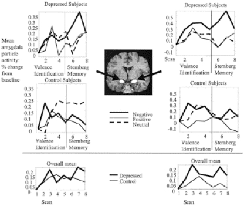
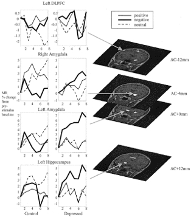
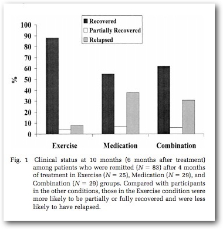
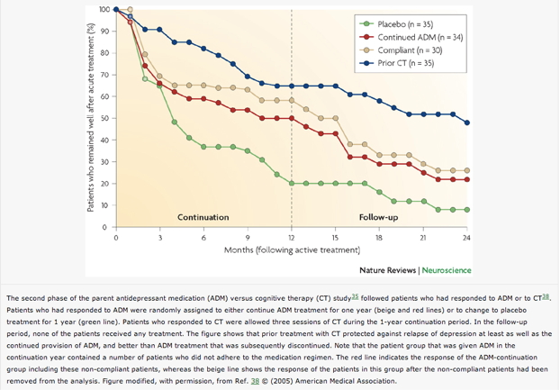
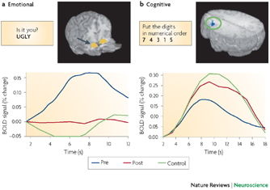
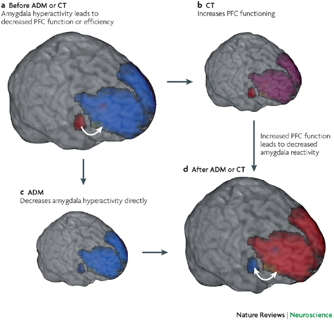

## Prelude

<iframe width="420" height="315" src="https://www.youtube.com/embed/k9Itt02QOO0" frameborder="0" allowfullscreen></iframe>

## Prelude II

<iframe width="420" height="315" src="https://www.youtube.com/embed/D_P-v1BVQn8" frameborder="0" allowfullscreen></iframe>

## Announcements

- **No class next Wednesday, 10/28**

## Today's Topics

- Wrap up on [happiness](https://rawgit.com/psu-psychology/psych-260/master/lectures/2015-10-21/260-2015-10-21-fear-stress.html)
- From normal to abnormal emotional expression

## Major affective (emotional) disorders

- Types
    + Bipolar disorder
    + Depression
    + Anxiety
- Heritability
    + *proportion of variance in trait accounted for by genetic factors*
    + Monozygotic: .69
    + Dizygotic: .13
    
## Depression

- Symptoms
    + Insomnia, lethargy, loss of pleasure, interest, energy
- Agitation
- Lasting for several weeks or more
- Prevalence (~10% lifetime)
- Females 2-3x males

## Neurological factors

- Reduced hippocampal volumes
- [[@videbech2004hippocampal]](http://dx.doi.org/10.1176/appi.ajp.161.11.1957) meta-analysis
- Meta-analysis combines effects across many different studies

## [[@videbech2004hippocampal]](http://dx.doi.org/10.1176/appi.ajp.161.11.1957)

## [[@videbech2004hippocampal]](http://dx.doi.org/10.1176/appi.ajp.161.11.1957)

## Neurological factors

- Hypoactivity in
    + Frontal and temporal cortex
    + Anterior cingulate
    + Insula
    + Cerebellum
- [[@fitzgerald_meta-analytic_2008]](http://dx.doi.org/10.1002/hbm.20426)

## [[@fitzgerald_meta-analytic_2008]](http://dx.doi.org/10.1002/hbm.20426){.smaller}

(a) patients v. controls, (b) patients on SSRIs, (c) patients v. ctrls (happy stim), (d) patients v. controls (sad stim)

## Neurological Factors

- Persistent activation in amygdala
- Amygdala and dorsolateral prefrontal cortex (DLPFC) inversely related
- [[@siegle_cant_2002]](http://dx.doi.org/10.1016/S0006-3223(02)01314-8)

## [[@siegle_cant_2002]](http://dx.doi.org/10.1016/S0006-3223(02)01314-8)

## [[@siegle_cant_2002]](http://dx.doi.org/10.1016/S0006-3223(02)01314-8)

## Disturbed sleep

- Less slow wave (stage 3 and 4) 
- More REM earlier in night (typical is longer REM as night goes on)

## Pharmacological factors

- Lowered thyroid function
- High/chronic corticol levels 
- Monoamine hypothesis
    + More: euphoria
    + Less: depression
    + Resperine (antagonist for NE & 5-HT) can cause depression
    + Low serotonin (5-HT) metabolite levels in CSF of suicidal depressives [[@samuelsson_csf_2006]](http://dx.doi.org/10.1111/j.1600-0447.2005.00639.x)
    
## [[@samuelsson_csf_2006]](http://dx.doi.org/10.1111/j.1600-0447.2005.00639.x)

## Treatments for depression

- Psychotherapy
    + Often effective when combined with drug treatment
- Drugs
- Exercise
- Electroconvulsive Shock (ECT)

## Drugs

- Monoamine oxidase (MAO) inhibitors
    + MAO destroys excess monoamines in terminal buttons
    + MAO-I’s boost monamine levels
- Tricyclics
    + Inhibit NE, 5-HT reuptake
    + Upregulate monoamine levels, but non-selective = side effects

## Drugs

- Selective Serotonin Reuptake Inhibitors (SSRIs)
    + Fluoxetine (Prozac, Paxil, Zoloft)
    + Prolong duration 5-HT in synaptic cleft
    + Also increase brain steroid production
- Selective Norepinephrine Reuptake Inhibitors (SNRIs)

## Problems with monoamine hypothesis

- Too simplistic
- NE, 5-HT interact
- Drugs fast acting (min), but improvement slow (weeks)

## What do drugs do, then?

- Receptor sensitivity altered?
    + Serotonin autoreceptors compensate
    + Postsynaptic upregulation of NE/5-HT effects
    + Link to neurotrophin BDNF
    + BDNF boosts neurogenesis

## Cybalta Ad

<iframe width="420" height="315" src="https://www.youtube.com/embed/OTZvnAF7UsA" frameborder="0" allowfullscreen></iframe>

## Prozac ad

<iframe width="420" height="315" src="https://www.youtube.com/embed/GWo571sERYM" frameborder="0" allowfullscreen></iframe>

## What do you think?

- How closely should drug advertising be regulated?
- Should some patients get treatment X because they ask for it?

## Exercise as a treatment

[[@babyak2000exercise]](http://journals.lww.com/psychosomaticmedicine/Abstract/2000/09000/Exercise_Treatment_for_Major_Depression_.6.aspx)

## Drugs vs. therapy

[[@derubeis_cognitive_2008]](http://dx.doi.org/10.1038/nrn2345)

## [[@derubeis_cognitive_2008]](http://dx.doi.org/10.1038/nrn2345)

## [[@derubeis_cognitive_2008]](http://dx.doi.org/10.1038/nrn2345)

## [[@derubeis_cognitive_2008]](http://dx.doi.org/10.1038/nrn2345)

## Depression's widespread impact

- Widespread brain dysfunction
- Prefrontal cortex, amygdala, HPA axis, circadian rhythms
- Genetic + environmental factors
- Disturbance in 5-HT, NE systems, cortisol

## References {.smaller}
