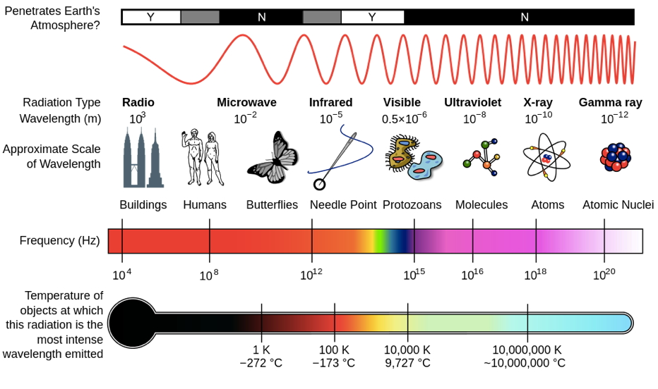
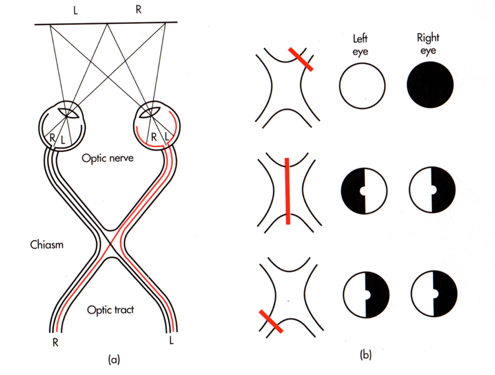

## Prelude

<iframe width="560" height="315" src="https://www.youtube.com/embed/FscIgtDJFXg" frameborder="0" allowfullscreen></iframe>

## Prelude

<iframe width="560" height="315" src="https://www.youtube.com/embed/x76VEPXYaI0" frameborder="0" allowfullscreen></iframe>

## Announcements

- Exam 3 next Friday

## Today's topics

- Vision

## How vision informs

- What's out there?
    + Shape, form, color
- Where is it?
    + Position, orientation, motion
    
## Electromagnetic (EM) radiation {.smaller}

<http://en.wikipedia.org/wiki/File:EM_Spectrum_Properties_edit.svg>

## Features of EM radiation

- Wavelength/frequency
- Intensity
- Location/position of source
- Reflects off some materials
- Refracted (bent) moving through other materials

## EM radiation provides information across space (and time)

## Reflectance spectra differ by surface

<http://http://www.vgt.vito.be/userguide/book_1/4/42/ie42bd.gif>

## [Optic array](https://en.wikipedia.org/wiki/Ambient_optic_array) specifies geometry of environment

## Color == categories of wavelength

- Eyes categorize wavelength into relative intensities within wavelength bands
- RGB ~ **R**ed, **G**reen, **B**lue
    + Long, medium, short wavelengths
- *Color is a neural/psychological construct*

## RGB monitors

## How a camera works

## The biological camera

## The biological camera

## Parts of the eye

- *Cornea* - refraction (2/3 of total)
- *Pupil* - light intensity; diameter regulated by Iris.
- *Lens* - refraction (remaining 1/3; focus)

## Parts of the eye

- *Retina* - light detection
    + ~ skin or organ of Corti
- *Pigment epithelium* - regenerate photopigment
- *Muscles* - move eye, reshape lens, change pupil diameter

## Eye forms image on retina

- Image inverted (up/down)
- Image reverseed (left/right)
- Point-to-point map (*retinotopic*)
- Binocular and monocular zones

## Retinal image

## Eyes views overlap

## The *fovea* {.smaller}

<http://www.brainhq.com/sites/default/files/fovea.jpg>

## The fovea

- Central 1-2 deg of visual field
- Aligned with visual axis
- *Retinal ganglion cells* pushed aside
- Highest *acuity* vision == best for details

## Acuity varies across fovea

## Acuity varies across fovea

<http://michaeldmann.net/pix_7/blndspot.gif>

## What part of the skin is like the fovea?

## *Photoreceptors* detect light

## Photoreceptors detect light

- *Rods*
    + ~120 M/eye
    + Mostly in periphery
    + Active in low light conditions
    + One wavelength range
    
## Photorceptors detect light

- *Cones*
    + ~5 M/eye
    + Mostly in center
    + 3 wavelength ranges
    
## Photoreceptors "specialize" in particular wavelengths {.smaller}

Anatomy & Physiology, Connexions Web site. http://cnx.org/content/col11496/1.6/, Jun 19, 2013.

    
## How photoreceptors work

- Outer segment
    + Membrane disks
    + Photopigments
- Inner segment
    + Synaptic terminal
- Light *hyperpolarizes* photoreceptor!
    + The *dark current*
    
## Retina

- Physiologically *backwards*
    + 
- Anatomically *inside-out*
    + 
  
## Retina

- Physiologically *backwards*
    + Dark current
- Anatomically *inside-out*
    + Photoreceptors at back of eye

## Retinal layers {.smaller}

<http://www.retinareference.com/anatomy/>

## Retinal layers

- Bipolar cells
    + Horizontal cells
- Retinal ganglion cells
    + Amacrine cells

## Next time...

- From eye to brain