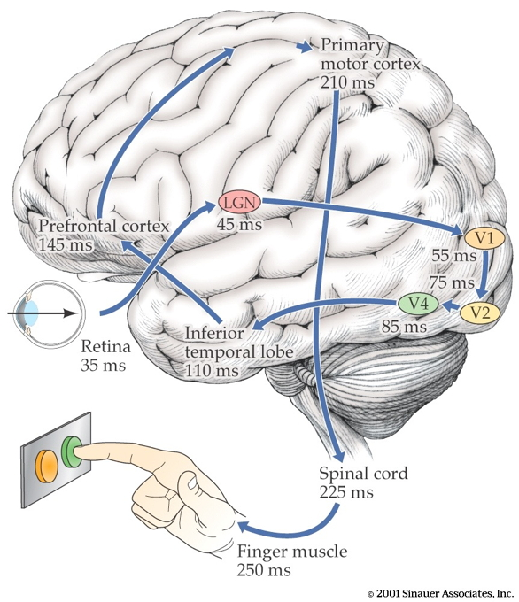
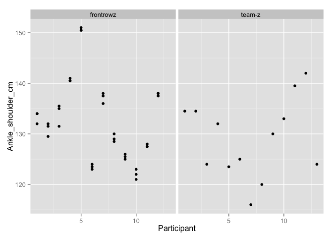
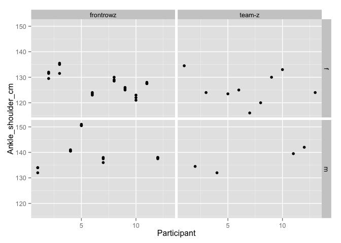
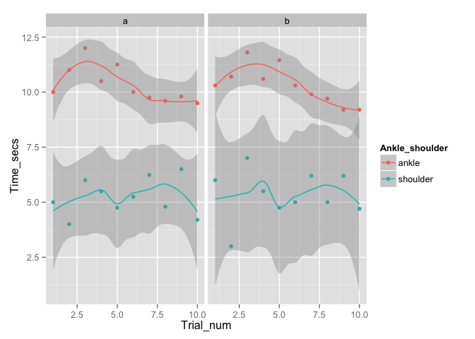
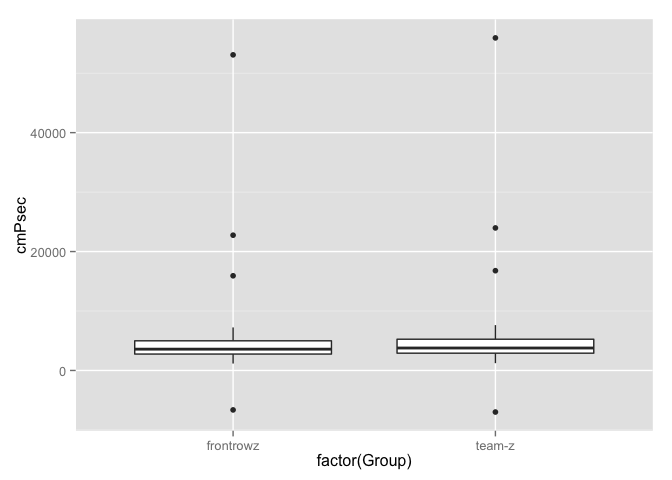

# 260-2015-11-30-speed-lab
Rick Gilmore  
`r Sys.time()`  

## Prelude

<iframe width="420" height="315" src="https://www.youtube.com/embed/LfmrHTdXgK4" frameborder="0" allowfullscreen></iframe>

## Announcements

- Quiz 4 next Monday, 12/7
- Exam 3 discussion, Exam 4 review 12/9
- Exam 4 on Monday, 12/14, 8a, **305 Wagner**
- Paper/blog posts due this Friday.

## Grades thus far

<div class="centered">

</div>

## Grades thus far

<div class="centered">

</div>


## Today's Topics

- Measuring the speed of thought

## The speed of thought

<div class="centered">

</div>

## Speed limits on thought and action

<div class="centered">

</div>

## Why should I care?

- Safe following speeds in driving
- False starts in track

## False starts in track

- Sprinter starts moving < 100 ms (0.1s) after starting gun
- Measured by force platforms in starting blocks
    + [ReacTime False Start Detection System](http://www.finishlynx.com/product/reactime/reactime-false-start-detection/)

## Examples {.smaller}

<div class="centered">


<http://condellpark.com/kd/reactiontime.htm>
</div>

## Why 100 ms?

- Fastest possible reaction time!
- Ear -> brain -> legs
- [Kosinski review](http://www.fon.hum.uva.nl/rob/Courses/InformationInSpeech/CDROM/Literature/LOTwinterschool2006/biae.clemson.edu/bpc/bp/Lab/110/reaction.htm)

## Let's measure!

- Groups of n>10
    + Mixed sex, single sex (if time)
    + Timer: Erin, or other students
    + Data scribe: Dr. G
- Measure ankle to shoulder (in cm) for each participant, 3x
    + Record on [spreadsheet](https://docs.google.com/spreadsheets/d/1c9i_g2iOhu6ghhUaZAhMBT_NjfFfWXpS-ICNC5zf5S4/edit?usp=sharing)

## Let's measure!

- Measure mass reaction time (10+ times)
    + Ankle condition
    + Shoulder condition
- Calculate average speed of conduction
    + ankle -> brain -> hand
    + shoulder -> brain -> hand
    + speed = distance/time

## Data analysis

- [Link to Google Docs](https://docs.google.com/spreadsheets/d/1c9i_g2iOhu6ghhUaZAhMBT_NjfFfWXpS-ICNC5zf5S4/edit?usp=sharing)

## Register Google Sheet


```r
require(googlesheets) # logs into Google with my account
nerve <- gs_title("psych-260-bbh-203-nerve-conduction-lab")
```

## Load body measure data into RStudio


```r
body <- gs_read(ws=1, nerve)
str(body)
```

## Load times data into RStudio


```r
times = gs_read(ws=2, nerve)
times
```

## Alternative: download data

- As .csv, comma-separated value
- Mine goes to ~/Downloads

## Alternative: Load data into RStudio (alternate way)


```r
body <- read.csv('~/Downloads/psych-260-bbh-203-nerve-conduction-lab - body-measurements.csv')
str(body)
```

```
## 'data.frame':	49 obs. of  5 variables:
##  $ Group            : Factor w/ 2 levels "frontrowz","team-z": 1 1 1 1 1 1 1 1 1 1 ...
##  $ Participant      : int  1 1 1 2 2 2 3 3 3 4 ...
##  $ Sex              : Factor w/ 2 levels "f","m": 2 2 2 1 1 1 1 1 1 2 ...
##  $ Ankle_shoulder_cm: num  134 134 132 130 132 ...
##  $ Measure_num      : int  1 2 3 1 2 3 1 2 3 1 ...
```

## Alternative: Load data into RStudio


```r
times <- read.csv('~/Downloads/psych-260-bbh-203-nerve-conduction-lab - time-measurements.csv')
    str(times)
```

```
## 'data.frame':	40 obs. of  4 variables:
##  $ Group         : Factor w/ 2 levels "frontrowz","team-z": 1 1 1 1 1 1 1 1 1 1 ...
##  $ Trial_num     : int  1 2 3 4 5 6 7 8 9 10 ...
##  $ Ankle_shoulder: Factor w/ 2 levels "ankle","shoulder": 2 2 2 2 2 2 2 2 2 2 ...
##  $ Time_secs     : num  3.84 2.09 2.15 2.38 2.13 2.16 2.04 2.13 2.28 2.5 ...
```

## Get ready to plot


```r
# Load libraries
require(ggplot2)
require(dplyr)
```

## Plot body measurements

<div class="centered">

```r
qplot(x=Participant, y=Ankle_shoulder_cm, data=body, facets = . ~ Group)
```

 
</div>

## Body measurements by Sex

<div class="centered">

```r
qplot(x=Participant, y=Ankle_shoulder_cm, data=body, facets = Sex ~ Group)
```

 
</div>

## Average body measurements within participants


```r
mean_length <- body %>% 
  group_by(Group, Participant) %>%
  summarize(mean_part_cm = mean(Ankle_shoulder_cm))
mean_length
```

```
## Source: local data frame [25 x 3]
## Groups: Group
## 
##        Group Participant mean_part_cm
## 1  frontrowz           1     133.3333
## 2  frontrowz           2     131.0000
## 3  frontrowz           3     134.0000
## 4  frontrowz           4     140.6667
## 5  frontrowz           5     150.6667
## 6  frontrowz           6     123.5000
## 7  frontrowz           7     137.1667
## 8  frontrowz           8     129.1667
## 9  frontrowz           9     125.5000
## 10 frontrowz          10     122.0000
## ..       ...         ...          ...
```

## Sum body measurements across groups


```r
total_length <- mean_length %>%
  group_by(Group) %>%
  summarize(total_cm = sum(mean_part_cm))
total_length
```

```
## Source: local data frame [2 x 2]
## 
##       Group total_cm
## 1 frontrowz   1592.5
## 2    team-z   1678.0
```

## Plot times

<div class="centered">

```r
qplot(x=Trial_num, y=Time_secs, data=times, facets = . ~ Group, color=Ankle_shoulder, geom=c("point", "smooth"))
```

```
## geom_smooth: method="auto" and size of largest group is <1000, so using loess. Use 'method = x' to change the smoothing method.
## geom_smooth: method="auto" and size of largest group is <1000, so using loess. Use 'method = x' to change the smoothing method.
```

 
</div>

## Calculate time difference


```r
ankle_times <- times %>%
  filter(Ankle_shoulder=="ankle") %>%
  select(Time_secs)

shoulder_times <- times %>%
  filter(Ankle_shoulder=="shoulder") %>%
  select(Time_secs)

times$Secs_diff <- ankle_times$Time_secs - shoulder_times$Time_secs
```

## Merge dataframes so can plot speeds


```r
merged <- merge(total_length, times, by="Group")
merged
```

```
##        Group total_cm Trial_num Ankle_shoulder Time_secs Secs_diff
## 1  frontrowz   1592.5         1       shoulder      3.84     -0.24
## 2  frontrowz   1592.5         2       shoulder      2.09      0.57
## 3  frontrowz   1592.5         3       shoulder      2.15      0.35
## 4  frontrowz   1592.5         4       shoulder      2.38      0.27
## 5  frontrowz   1592.5         5       shoulder      2.13      0.40
## 6  frontrowz   1592.5         6       shoulder      2.16      0.34
## 7  frontrowz   1592.5         7       shoulder      2.04      0.46
## 8  frontrowz   1592.5         8       shoulder      2.13      0.37
## 9  frontrowz   1592.5         9       shoulder      2.28      0.22
## 10 frontrowz   1592.5        10       shoulder      2.50      0.03
## 11 frontrowz   1592.5         1          ankle      3.60      1.37
## 12 frontrowz   1592.5         2          ankle      2.66      0.07
## 13 frontrowz   1592.5         3          ankle      2.50      0.57
## 14 frontrowz   1592.5         4          ankle      2.65      0.93
## 15 frontrowz   1592.5         5          ankle      2.53      0.10
## 16 frontrowz   1592.5         6          ankle      2.50      0.60
## 17 frontrowz   1592.5         7          ankle      2.50      0.54
## 18 frontrowz   1592.5         8          ankle      2.50      0.43
## 19 frontrowz   1592.5         9          ankle      2.50      0.52
## 20 frontrowz   1592.5        10          ankle      2.53      0.88
## 21    team-z   1678.0         1       shoulder      3.13     -0.24
## 22    team-z   1678.0         2       shoulder      4.06      0.57
## 23    team-z   1678.0         3       shoulder      3.00      0.35
## 24    team-z   1678.0         4       shoulder      2.97      0.27
## 25    team-z   1678.0         5       shoulder      3.09      0.40
## 26    team-z   1678.0         6       shoulder      2.81      0.34
## 27    team-z   1678.0         7       shoulder      3.18      0.46
## 28    team-z   1678.0         8       shoulder      2.94      0.37
## 29    team-z   1678.0         9       shoulder      2.85      0.22
## 30    team-z   1678.0        10       shoulder      2.78      0.03
## 31    team-z   1678.0         1          ankle      4.50      1.37
## 32    team-z   1678.0         2          ankle      4.13      0.07
## 33    team-z   1678.0         3          ankle      3.57      0.57
## 34    team-z   1678.0         4          ankle      3.90      0.93
## 35    team-z   1678.0         5          ankle      3.19      0.10
## 36    team-z   1678.0         6          ankle      3.41      0.60
## 37    team-z   1678.0         7          ankle      3.72      0.54
## 38    team-z   1678.0         8          ankle      3.37      0.43
## 39    team-z   1678.0         9          ankle      3.37      0.52
## 40    team-z   1678.0        10          ankle      3.66      0.88
```

## Calculate speeds and add to dataframe


```r
merged <- merged %>%
  mutate(cmPsec=total_cm/Secs_diff)
merged
```

```
##        Group total_cm Trial_num Ankle_shoulder Time_secs Secs_diff
## 1  frontrowz   1592.5         1       shoulder      3.84     -0.24
## 2  frontrowz   1592.5         2       shoulder      2.09      0.57
## 3  frontrowz   1592.5         3       shoulder      2.15      0.35
## 4  frontrowz   1592.5         4       shoulder      2.38      0.27
## 5  frontrowz   1592.5         5       shoulder      2.13      0.40
## 6  frontrowz   1592.5         6       shoulder      2.16      0.34
## 7  frontrowz   1592.5         7       shoulder      2.04      0.46
## 8  frontrowz   1592.5         8       shoulder      2.13      0.37
## 9  frontrowz   1592.5         9       shoulder      2.28      0.22
## 10 frontrowz   1592.5        10       shoulder      2.50      0.03
## 11 frontrowz   1592.5         1          ankle      3.60      1.37
## 12 frontrowz   1592.5         2          ankle      2.66      0.07
## 13 frontrowz   1592.5         3          ankle      2.50      0.57
## 14 frontrowz   1592.5         4          ankle      2.65      0.93
## 15 frontrowz   1592.5         5          ankle      2.53      0.10
## 16 frontrowz   1592.5         6          ankle      2.50      0.60
## 17 frontrowz   1592.5         7          ankle      2.50      0.54
## 18 frontrowz   1592.5         8          ankle      2.50      0.43
## 19 frontrowz   1592.5         9          ankle      2.50      0.52
## 20 frontrowz   1592.5        10          ankle      2.53      0.88
## 21    team-z   1678.0         1       shoulder      3.13     -0.24
## 22    team-z   1678.0         2       shoulder      4.06      0.57
## 23    team-z   1678.0         3       shoulder      3.00      0.35
## 24    team-z   1678.0         4       shoulder      2.97      0.27
## 25    team-z   1678.0         5       shoulder      3.09      0.40
## 26    team-z   1678.0         6       shoulder      2.81      0.34
## 27    team-z   1678.0         7       shoulder      3.18      0.46
## 28    team-z   1678.0         8       shoulder      2.94      0.37
## 29    team-z   1678.0         9       shoulder      2.85      0.22
## 30    team-z   1678.0        10       shoulder      2.78      0.03
## 31    team-z   1678.0         1          ankle      4.50      1.37
## 32    team-z   1678.0         2          ankle      4.13      0.07
## 33    team-z   1678.0         3          ankle      3.57      0.57
## 34    team-z   1678.0         4          ankle      3.90      0.93
## 35    team-z   1678.0         5          ankle      3.19      0.10
## 36    team-z   1678.0         6          ankle      3.41      0.60
## 37    team-z   1678.0         7          ankle      3.72      0.54
## 38    team-z   1678.0         8          ankle      3.37      0.43
## 39    team-z   1678.0         9          ankle      3.37      0.52
## 40    team-z   1678.0        10          ankle      3.66      0.88
##       cmPsec
## 1  -6635.417
## 2   2793.860
## 3   4550.000
## 4   5898.148
## 5   3981.250
## 6   4683.824
## 7   3461.957
## 8   4304.054
## 9   7238.636
## 10 53083.333
## 11  1162.409
## 12 22750.000
## 13  2793.860
## 14  1712.366
## 15 15925.000
## 16  2654.167
## 17  2949.074
## 18  3703.488
## 19  3062.500
## 20  1809.659
## 21 -6991.667
## 22  2943.860
## 23  4794.286
## 24  6214.815
## 25  4195.000
## 26  4935.294
## 27  3647.826
## 28  4535.135
## 29  7627.273
## 30 55933.333
## 31  1224.818
## 32 23971.429
## 33  2943.860
## 34  1804.301
## 35 16780.000
## 36  2796.667
## 37  3107.407
## 38  3902.326
## 39  3226.923
## 40  1906.818
```

## Plot speeds vs. Trial_num

<div class="centered">

```r
qplot(x=Trial_num, y=cmPsec, data=merged, facets = . ~ Group, geom=c("point", "smooth"))
```

```
## geom_smooth: method="auto" and size of largest group is <1000, so using loess. Use 'method = x' to change the smoothing method.
## geom_smooth: method="auto" and size of largest group is <1000, so using loess. Use 'method = x' to change the smoothing method.
```

 
</div>

## Plot speeds by Group

<div class="centered">

```r
qplot(x = factor(Group), y=cmPsec, data=merged, geom="boxplot")
```

 
</div>

## Summarize mean, standard dev, median Speed (in m/s)


```r
# Convert to 
merged_summ <- merged %>%
  group_by(Group) %>%
  summarize(mean_spd = mean(cmPsec/100), stdev_spd = sd(cmPsec/100), median_spd = median(cmPsec/100))
merged_summ
```

```
## Source: local data frame [2 x 4]
## 
##       Group mean_spd stdev_spd median_spd
## 1 frontrowz 70.94108  122.7900   35.82722
## 2    team-z 74.74985  129.3825   37.75076
```

## Next steps

- Write up (2-4 pp, double-spaced)
    + Introduction
    + Methods
    + Results
    + Discussion
- Worth 15 points (extra credit or replace paper/blog)
