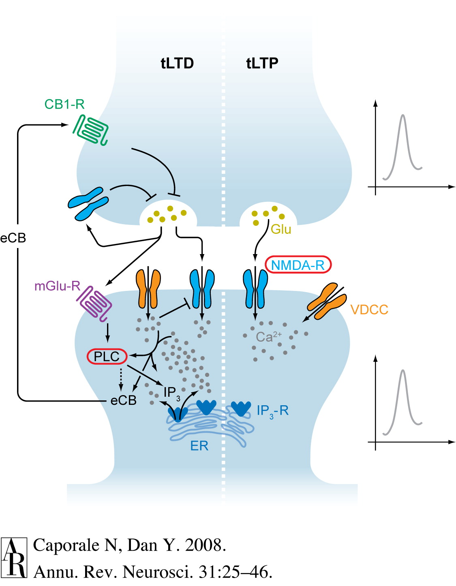

## Prelude

<iframe width="420" height="315" src="https://www.youtube.com/embed/nSz16ngdsG0" frameborder="0" allowfullscreen></iframe>

## Prelude

<iframe width="420" height="315" src="https://www.youtube.com/embed/4-L6rEm0rnY" frameborder="0" allowfullscreen></iframe>

## Announcements

- Paper/blog posts due this Friday
- Lab write-up due Monday 12/7
- Quiz 4 next Monday, 12/7, Exam 3 returned
- Exam 4 review next Wednesday, 12/9
- Exam 4 on Monday, 12/14, 8a, **305 Wagner**

## Today's Topics

- Learning and memory

## Memory capacity of the human brain?

- 1e12 neurons
- 1e3 synapses/neuron
- 1e15 synapses or 1.25e14 bytes
- 1e9 gigabyte, 1e12 terabyte, 1e15 petabyte

<http://www.scientificamerican.com/article.cfm?id=what-is-the-memory-capacity>

## What is learning and memory anyway?

- Learning
    + ?
- Memory
    + ?
    
## How do you known when you've

- Learned?
- Remembered?

## What is learning and memory anyway?

- Learning
    + Change in perception, thought, behavior, emotion over time
- Memory
    + Information derived from past experience that influences current behavior
    
## Biological basis of L&M?

- Changes in patterns of neural activity
- Changes in patterns of connectivity
    + New synapses
    + Changes in synaptic strength (+/-)
    
## How do synapses change strength?

## Donald Hebb's Insight

*When an axon of cell A is near enough to excite cell B and repeatedly or persistently takes part in firing it, some growth process or metabolic change takes place in one or both cells such that A’s efficacy, as on of the cells firing B, is increased.* (Hebb, 1949, p. 62)

*Neurons that fire together wire together.* (Lowell & Singer, 1992, p. 211).

## NMDA receptor and *'Hebbian' learning*

- Coincidence detector
    + Sending cell has released NT
    + Receiving cell is/has been recently active
- Chemically-gated
    + Ligand- (glutamate + glycine co-factor) gated
- Voltage-gated
    + Mg++ ion 'plug' removed under depolarization

## NMDA receptor figure

<https://upload.wikimedia.org/wikipedia/commons/thumb/0/00/Activated_NMDAR.svg/220px-Activated_NMDAR.svg.png>

## NMDA receptors contribute to associative learning

- Associate (link)
    + Concept A -> Concept B
    + Neuron A -> Neuron B
    
## Donald

## Donald

- Trump
- Duck
- Draper
- Duck

## [Long-term potentiation (LTP)](https://en.wikipedia.org/wiki/Long-term_potentiation) {.smaller}

<https://upload.wikimedia.org/wikipedia/commons/thumb/b/b9/LTP_exemplar.jpg/800px-LTP_exemplar.jpg>

## Long-term potentiation (LTP)

- Increase in synaptic strength based on recent activity.

## Spike-timing-dependent plasticity

[[@caporale2008spike]](http://dx.doi.org/10.1146/annurev.neuro.31.060407.125639)

   
## Spike-timing-dependent plasticity

[[@caporale2008spike]](http://dx.doi.org/10.1146/annurev.neuro.31.060407.125639)

## Spike-timing-dependent plasticity

- A before B: strengthen A->B
- A after B: weaken A->B
- [*Neural Plasticity*](https://en.wikipedia.org/wiki/Neuroplasticity)
    + Lasting hanges in neural firing, connectivity
- NMDA receptor molecular mechanism for implementing LTP and spike-timing-dependent plasticity

## How does LTP work?

- Ca++ entry triggers biochemical cascade
- Existing (AMPA) glutamate receptors made to stay open longer
- New AMPA Glu receptors synthesized, inserted into postsynaptic membrane

## LTP signaling {.smaller}

<http://thebrain.mcgill.ca/flash/a/a_07/a_07_m/a_07_m_tra/a_07_m_tra.html>

## Dimensions of stored info

- Memory of what?
    + Facts/events/places vs. skills
- Memory of when?
    + Immediate vs. distant past
- Memory for how long?
    + Seconds vs. years

## Memory systems in the brain

[[@squire_memory_2004]](http://dx.doi.org/10.1016/j.nlm.2004.06.005)

## Main points

- Learning and memory involve changes in neural firing, circuitry
- Hebbian learning a type of associative learning
- NMDA receptor as coincidence detector
    + Molecular basis of one form of long-term potentiation (LTP)
- Different types of information stored in different brain systems

## Next time...

- The hippocampus
- Disorders of learning and memory

## References {.smaller}
