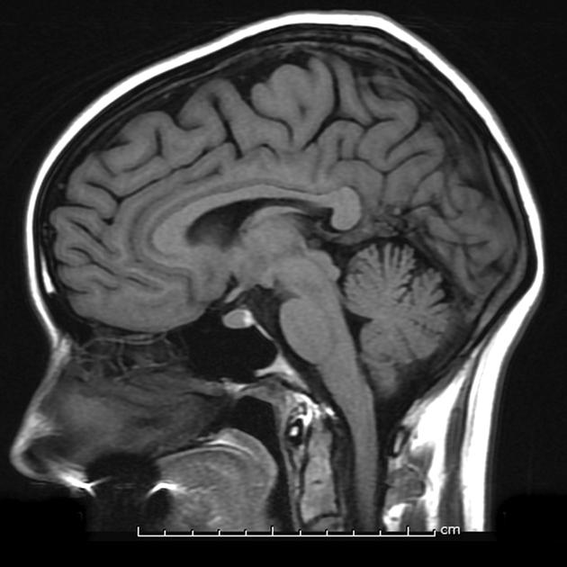

## Prelude

<iframe width="420" height="315" src="https://www.youtube.com/embed/snO68aJTOpM" frameborder="0" allowfullscreen></iframe>

## Spatial and Temporal Resolution

[@sejnowski2014putting]

## Which of the following statements about the brain imaging technique used in this figure is FALSE?

## Which of the following statements about the brain imaging technique used in this figure is FALSE?

- A. It is non-invasive.
- B. It provides information about brain structures.
- C. It provides information about rapid (millisecond-level) changes in brain activity.
- D. It cannot resolve details about individual neurons.

## Which of the following statements about the brain imaging technique used in this figure is FALSE?

- A. It is non-invasive.
- B. It provides information about brain structures.
- **C. It provides information about rapid (millisecond-level) changes in brain activity.**
- D. It cannot resolve details about individual neurons.

## Today's topics

- Functional methods
- Neuroanatomy

## Functional methods

- Recording from the brain 
- Interfering with the brain 
- Stimulating the brain

## Recording from the brain

- Single/multi unit recording
- Microelectrodes
- Small numbers of nerve cells

## Single/multi-unit Recording

<http://www.nature.com/nrn/journal/v5/n11/images/nrn1535-i1.jpg>

## Single/multi-unit recording

- What does neuron X respond to?
- Great temporal (ms), spatial resolution (um)
- Invasive
- Rarely suitable for humans, but...

## Electrocorticography

## Calcium imaging [[@Nguyen28122015]](http://doi.org/10.1073/pnas.1507110112)

<iframe width="420" height="315" src="https://www.youtube.com/embed/2Go4LjX5eHo" frameborder="0" allowfullscreen></iframe>

## Calcium imaging

- Calcium (Ca++) enters neurons during chemical communication
- Genetically engineered animals can express [proteins](http://www.scholarpedia.org/article/Fluorescent_proteins) that fluoresce in presence of Ca++ and fluorescent light
- Nematode [C. Elegans](https://en.wikipedia.org/wiki/Caenorhabditis_elegans) has 302 neurons.
- Can image activity while worm moves!

## Single unit recording, Ca++ imaging

- Evaluating
    - Spatial resolution high/fine (resolves small spatial details)
    - Temporal resolution high/fine (rapid changes)
    - Invasive

## Positron Emission Tomography (PET)

<iframe width="560" height="315" src="https://www.youtube.com/embed/GHLBcCv4rqk" frameborder="0" allowfullscreen></iframe>

## Positron Emission Tomography (PET)

- Radioactive tracers (glucose, oxygen)
- Positron decay
- Experimental condition - control
- Average across individuals

## PET

- Evaluating PET
    + Temporal (~ s) and spatial (mm-cm) resolution worse than fMRI
    + Radioactive exposures + mildly invasive 
    + Dose < airline crew exposure in 1 yr

## Functional Magnetic Resonance Imaging (fMRI)

- Neural activity -> local O^2 consumption increase
- Blood Oxygen Level Dependent (BOLD) response
    + Oxygenated vs. deoxygenated hemoglobin
    + Do regional blood O^^2 levels (and flow) vary with behavior X?
    
## fMRI

## fMRI [[@dougherty_visual_2003]](http://doi.org/10.1167/3.10.1)

## fMRI

- Evaluating
    + Non-invasive, but expensive
    + Moderate but improving (mm) spatial, temporal (~sec) resolution
- Hemodynamic Response Function
    + 1s delay plus 3-6 s ramp-up

## Hemodynamic Response Function (HRF)

## Electroencephalography (EEG)

- How does it work?
    - Electrodes on scalp or brain surface
- What do we measure?
    - Combined activity of huge # of neurons

## EEG

## EEG

- High temporal, poor spatial resolution
- Analyze frequency bands
    + LOW: deep sleep
    + MIDDLE: Quiet, alert state
    + HIGH:“Binding” information across senses
  
## EEG Frequency

## Event-related potentials (ERPs)

- EEGs time-locked to some event - Averaged over many trials

## ERPs

## [Brain Computer Interface (BCI)](http://computer.howstuffworks.com/brain-computer-interface.htm)

<http://s.hswstatic.com/gif/brain-computer-interface-3.gif>

## Magneto-encephalography (MEG)

- Like EEG, but measuring magnetic fields
- High temporal resolution, low spatial resolution
- Magnetic field propagates w/o distortion

## MEG

## Manipulating the brain

- Nature’s “experiments”
    + Stroke, head injury, tumor
    + Neuropsychology
    + Remember Galen?
- Logic: damage impairs performance = region critical for behavior
- Poor spatial/temporal resolution, limited experimental control

## Phineas Gage

## Stimulating the brain

- Pharmacological
- Electrical (transcranial Direct Current Stimulation - tDCS)
- Magnetic (Transcranial magnetic stimulation - TMS)
- Optically (optogenetics)

## tDCS

## TMS

## Optogenetic stimulation

<iframe width="560" height="315" src="https://www.youtube.com/embed/I64X7vHSHOE?list=PLRstm0n591-rBbOeC0SJEy20-NwXpLo4G" frameborder="0" allowfullscreen></iframe>

## Evaluating stimulation methods

- Spatial/temporal resolution?
    + Assume stimulation mimics natural activity?
    + Optogenetic stimulation highly similar, others less so
- Deep brain stimulation as therapy
    + Parkinson’s Disease 
    + Depression 
    + Epilepsy

## Deep brain stimulation

## Simulating the brain

- Computer/mathematical models of brain function
- Example: neural networks
- Cheap, noninvasive, can be stimulated or “lesioned”

## Growing a brain

<http://www.kurzweilai.net/most-complete-functioning-human-brain-model-to-date-according-to-researchers>

<http://www.kurzweilai.net/images/organoid-derivation-development.jpg>

## Spatial and Temporal Resolution

[@sejnowski2014putting]

## Brain anatomy through dance

## Finding our way around

### Anterior/Posterior
### Medial/Lateral
### Superior/Inferior
### Dorsal/Ventral
### Rostral/Caudal

## Directional image

<https://upload.wikimedia.org/wikipedia/commons/thumb/e/e7/Blausen_0019_AnatomicalDirectionalReferences.png/800px-Blausen_0019_AnatomicalDirectionalReferences.png>

## Bipeds vs. quadripeds

<https://upload.wikimedia.org/wikipedia/commons/thumb/0/00/1303_Human_Neuroaxis.jpg/800px-1303_Human_Neuroaxis.jpg>

## No matter how you slice it

### Horizontal/Axial
### Coronal/Transverse/Frontal
### Sagittal (from the side)

## Slice diagram

<http://www.scienceteacherprogram.org/biology/chillemistudentguide1-06/brain_directions_planes_sections__directions_-_small.gif>

## Supporting structures

### Meninges
### Ventricular system
### Blood supply

## Meninges

### Dura mater
### Arachnoid membrane
### Subarachnoid space
### Pia mater

## Meninges

<https://upload.wikimedia.org/wikipedia/commons/thumb/8/8e/Meninges-en.svg/1280px-Meninges-en.svg.png>

## Ventricular system

<https://upload.wikimedia.org/wikipedia/commons/d/d4/Blausen_0896_Ventricles_Brain.png>

## Ventricles

### Lateral (1st & 2nd)
### 3rd
### Cerebral aqueduct 
### 4th

### Cerebrospinal fluid (CSF)

- Clears metabolites during sleep [@xie2013sleep].

## Blood Supply

<http://surgery.med.miami.edu/images/Circulation_of_brain.gif>

## Blood Supply

### Arteries
- Circle of Willis

### Blood/brain barrier
- Cells forming blood vessel walls tightly packed
- Active transport of molecules typically required

## Blood/brain barrier

<http://www.nature.com/nrn/journal/v7/n1/images/nrn1824-f3.jpg>

## Area Postrema

- Brainstem, blood-brain barrier thin

<http://www.nature.com/nrendo/journal/v9/n10/images/nrendo.2013.136-f2.jpg>

## Organization of the Nervous System

### Central Nervous System (CNS) 

- Brain
- Spinal Cord
- Everything encased in bone

### Peripheral Nervous System (PNS)

- Autonomic Nervous System
   - Sympathetic nervous system
    - Parasympathetic nervous system
    - Enteric nervous system
 - Somatic Nervous System

## Organization of the brain

| Major division | Ventricular Landmark | Embryonic Division | Structure       |
|----------------|----------------------|--------------------|-----------------|
| Forebrain      | Lateral              | Telencephalon      | Cerebral cortex |
|                |                      |                    | Basal ganglia   |
|                |                      |                    | Hippocampus, amygdala |
|                | Third                | Diencephalon       | Thalamus        |
|                |                      |                    | Hypothalamus    |
| Midbrain       | Cerebral Aqueduct    | Mesencephalon      | Tectum, tegmentum |

## Organization of the brain

| Major division | Ventricular Landmark | Embryonic Division | Structure         |
|----------------|----------------------|--------------------|-------------------|
| Hindbrain      | 4th                  | Metencephalon      | Cerebellum, pons  |
|                | --                   | Mylencephalon      | Medulla oblongata |

## References {.smaller}

