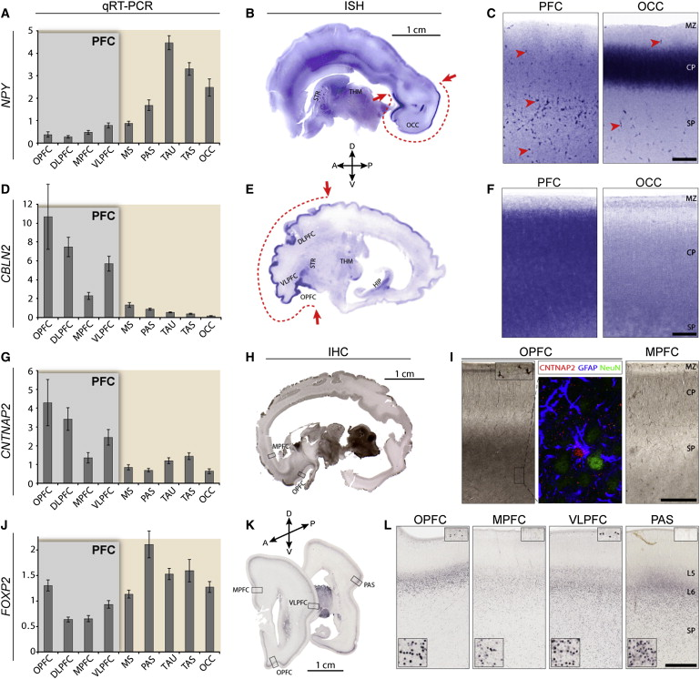

## Prelude

<iframe width="420" height="315" src="https://www.youtube.com/embed/mMDPP-Wy3sI" frameborder="0" allowfullscreen></iframe>

## Today's Topics

- From brain evolution to brain development
- Or, how did the human brain get this way?

## Ways human brains differ

- Larger than body size of comparable mammals
- Large cerebral cortex
- Large-scale folding (gyri and sulci)
- Large cortical association areas
    + Not primary sensory or motor areas

## Association areas

    
## How did it get this way?

- Prolonged (in time) pattern of development
- Specialized pattern of development

## Human brain development take homes

- Prenatal
    + Neuro- and gliogenesis
    + Migration
    + Synaptogenesis begins
    + Differentiation
    + Apoptosis
    + Myelination begins
    + Infant gene expression ≠ Adult
    
## Human brain development take homes

- Postnatal
    + Synaptogenesis
    + Cortical expansion, activity-dependent change
    + Myelination
    + Prolonged period of postnatal/pre-reproductive development, i.e., childhood [@konner_evolution_2011]

## Neurulation

    
## Formation of neural tube (neurulation)

- Ectoderm, mesoderm, endoderm
- Ectoderm folds on itself to form neural tube
    + ~18-26 days post-fertilization
- Neural tube becomes
    + Ventricles
    + Central canal of spinal cord
    
## Neurulation

- Failures of neural tube closure
    + Spina bifida
    + Anencephaly
    
## Spina Bifida

## Neurogenesis and gliogenesis

- Stem cells along ventricles
- Symmetric cell division
    + Daughter cells can also divide, increases # of proliferative cells
- Asymmetric cell division
    + Daughter cells post-mitotic (don't divide)

## Radial glia

## Cell migration

## Radial unit hypothesis

[[@rakic2009evolution]](http://dx.doi.org/10.1038/nrn2719)

## Migration

<iframe width="420" height="315" src="https://www.youtube.com/embed/ZRF-gKZHINk" frameborder="0" allowfullscreen></iframe>

## Migration

<iframe width="420" height="315" src="https://www.youtube.com/embed/t-8bxeWqSV4" frameborder="0" allowfullscreen></iframe>

## Glial migration

<http://physrev.physiology.org/content/81/2/871>

## Axon growth cone

<iframe width="420" height="315" src="https://www.youtube.com/embed/Fgmt2RBow0I" frameborder="0" allowfullscreen></iframe>

## Axons follow

- Chemoattractants
    + e.g., Nerve Growth Factor (NGF)
- Chemorepellents
- Receptors in growth cone detect chemical gradients

## Differentiation

- Neuron vs. glial cell
- Cell type
- NTs released
- Where to connect

## Differential gene expression

[[johnson2009functional]](http://dx.doi.org/10.1016/j.neuron.2009.03.027)

## Prefrontal vs. Other Ctx

[[johnson2009functional]](http://dx.doi.org/10.1016/j.neuron.2009.03.027)

## Synaptogenesis

## Postnatal patterns of synaptogenesis

## Proliferation, pruning

- Early proliferation
- Later pruning
- Rates, peaks differ by area

## Apoptosis

- 20-80%, varies by area
- Spinal cord >> cortex

## Apoptosis and cortical expansion

[[@rakic2009evolution]](http://dx.doi.org/10.1038/nrn2719)

## Synaptic rearrangement

## Myelination

## Myelination

- Neonatal brain largely unmyelinated
- Gradual myelination, peaks in mid-20s
- Spinal cord before brain
- Sensory before motor

## Diffusion Tensor Imaging (DTI)

- Structural MRI measure
- Diffusion of water molecules
- Diffusion in a specific direction (aniosotropy) -> white matter integrity

## DTI

<iframe width="560" height="315" src="https://www.youtube.com/embed/atLQVgUwnrY" frameborder="0" allowfullscreen></iframe>

## Myelination across human development

[[@Hagmann02112010]](http:/doi.org/10.1073/pnas.1009073107)

## Myelination changes "network" properties

[[@Hagmann02112010]](http:/doi.org/10.1073/pnas.1009073107)

## Synaptic rearrangment, myelination change cortical thickness

- [@gogtay2004dynamic]
- Areal differences in cortical thickness change

## Human brain development take homes

- Prenatal
    + Neuro- and gliogenesis
    + Migration
    + Synaptogenesis begins
    + Differentiation
    + Apoptosis
    + Myelination begins
    + Infant gene expression ≠ Adult
    
## Human brain development take homes

- Postnatal
    + Synaptogenesis
    + Cortical expansion, activity-dependent change
    + Myelination
    + Prolonged period of postnatal/pre-reproductive development 

[@konner_evolution_2011]
    
## How brain development clarifies anatomical structure

## 3-4 weeks

## 4 weeks

<https://upload.wikimedia.org/wikipedia/commons/4/4c/4_week_embryo_brain.jpg>

## ~4 weeks

## 6 weeks

<https://upload.wikimedia.org/wikipedia/commons/thumb/3/33/6_week_human_embryo_nervous_system.svg/500px-6_week_human_embryo_nervous_system.svg.png>

## ~6 weeks

## Beyond

## Organization of the brain

| Major division | Ventricular Landmark | Embryonic Division | Structure       |
|----------------|----------------------|--------------------|-----------------|
| Forebrain      | Lateral              | Telencephalon      | Cerebral cortex |
|                |                      |                    | Basal ganglia   |
|                |                      |                    | Hippocampus, amygdala |
|                | Third                | Diencephalon       | Thalamus        |
|                |                      |                    | Hypothalamus    |
| Midbrain       | Cerebral Aqueduct    | Mesencephalon      | Tectum, tegmentum |

## Organization of the brain

| Major division | Ventricular Landmark | Embryonic Division | Structure         |
|----------------|----------------------|--------------------|-------------------|
| Hindbrain      | 4th                  | Metencephalon      | Cerebellum, pons  |
|                | --                   | Mylencephalon      | Medulla oblongata |

## References {.smaller}
