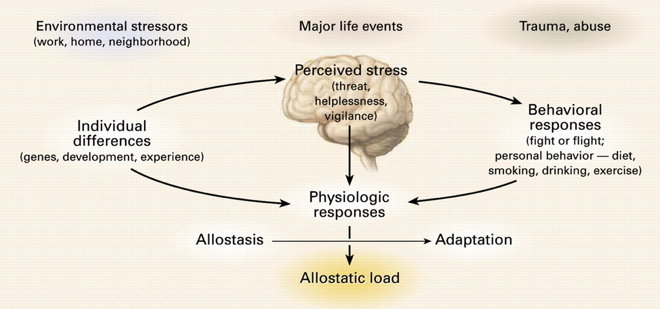
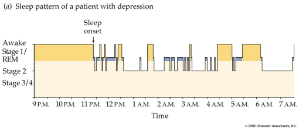
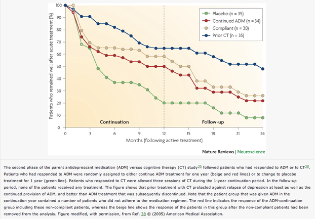
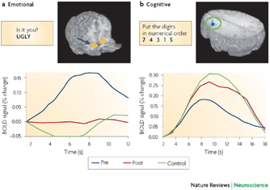
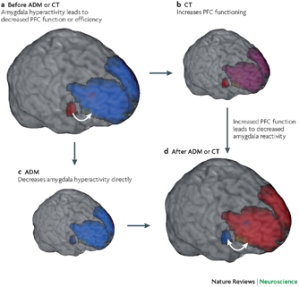

## Let it go...

<iframe width="560" height="315" src="https://www.youtube.com/embed/L0MK7qz13bU" frameborder="0" allowfullscreen></iframe>

## Why Worry Now?

<iframe width="420" height="315" src="https://www.youtube.com/embed/7no9Ak2uSrQ" frameborder="0" allowfullscreen></iframe>

## Announcements

- [Exam 2 scores](../grades/img/2016-03-18.png)
- Quiz 3 next Tuesday, 3/29
- **Exam 4/Final Scheduled**
    + Section 001: Tue, 5/3, 12:20-2:10pm, 358 Willard
    + Section 004: Thu, 5/5, 4:40-6:30pm, 208 Ford

## Today's Topics

- Fear
- Stress
- Depression

## Last time

- Happiness/pleasure/reward circuits
- Fear and the amygdala

## Emotion <==> Cognition?

[[@pessoa_relationship_2008]](http://dx.doi.org/10.1038/nrn2317)

## [[@pessoa_relationship_2008]](http://dx.doi.org/10.1038/nrn2317)

*Here, I will argue that complex cognitive–emotional behaviours have their basis in dynamic coalitions of networks of brain areas, none of which should be conceptualized as specifically affective or cognitive. Central to cognitive–emotional interactions are brain areas with a high degree of connectivity, called hubs, which are critical for regulating the flow and integration of information between regions.*

## Circuits for survival

[[@ledoux_rethinking_2012]](http://dx.doi.org/10.1016/j.neuron.2012.02.004)

## Emotion as global "state"

[[@ledoux_rethinking_2012]](http://dx.doi.org/10.1016/j.neuron.2012.02.004)

## "Emotional" stimuli serve multiple roles

[[@ledoux_rethinking_2012]](http://dx.doi.org/10.1016/j.neuron.2012.02.004)

## Biological imperatives and stress

- Sustenance
    + Hunger, thirst
- Well-being/defense
    + Threat
    
## Biological imperatives and stress

- Reproduction
    + Rejection
- Affiliation
    + Loneliness
     
## Stress and the brain

[[@mcewen_physiology_2007]](http://dx.doi.org/10.1152/physrev.00041.2006)

## Brain under stress 

- Brain detects threat
- Mobilizes physiological, behavioral responses
- Acute stress
    + Short duration
    + Fast action required
    + HPA (Cortisol), SAM (NE/Epi) axes
- vs. Chronic stress
    
## Glucocorticoids

- Adrenal cortex releases hormones
    + Cortisol (hydrocortisone)
        * Increases blood glucose levels
        * Suppresses immune system
        * Reduces inflammation
        * Aids in metabolism
    + Receptors in brain and body

## Cortisol and the brain

<http://www.molecularbrain.com/content/figures/1756-6606-3-2-1-l.jpg>

## Glucocorticoid cascade hypothesis

- Cort receptors in Hip
- Hip regulates HPA axis via hyp
- Prolonged cortisol exposure reduces hip response
- Reduced volume, connectivity in hip
- Hip critical for long-term memory formation
- Chronic stress impairs long-term memory

## But, cortisol -> stress link not straightforward

[[@faresjo_higher_2013]](http://dx.doi.org/10.1371/journal.pone.0073828)

## Let it go...

- Reaction to stress more important than its frequency [[@sin_linking_2016]](http://doi.org/10.1097/PSY.0000000000000306)
- *"...Individual differences in daily negative affect and responses to daily stressors were more strongly related to cardiovascular autonomic regulation than the frequency of such stressors."*

## [[@sin_linking_2016]](http://doi.org/10.1097/PSY.0000000000000306)

## Can Poverty Impede Cognitive Function?

[[@mani_poverty_2013]](http://dx.doi.org/10.1126/science.1238041)

## [[@mani_poverty_2013]](http://dx.doi.org/10.1126/science.1238041)

[[@mani_poverty_2013]](http://dx.doi.org/10.1126/science.1238041)

## Why Zebras Don't Get Ulcers

## Your stress ain't like mine

- Phasic (short-term) vs. Chronic (long-term)
- Physical stress (hunger, thirst, injury, disease) vs. social stress
- Sex differences

## [[@bangasser_sex_2014]](http://doi.org/10.1016/j.yfrne.2014.03.008)

## [[@bangasser_sex_2014]](http://doi.org/10.1016/j.yfrne.2014.03.008)

## [[@bangasser_sex_2014]](http://doi.org/10.1016/j.yfrne.2014.03.008)

## Summary

- Fear and the amygdala
- Emotion as as global state serving survival goals
- Individual, sex differences in stress response

## Major affective (emotional) disorders

- Types
    + Bipolar disorder
    + Depression
    + Anxiety
- Heritability
    + *proportion of variance in trait accounted for by genetic factors*
    + Monozygotic: .69
    + Dizygotic: .13
    
## Depression

- Symptoms
    + Insomnia, lethargy, loss of pleasure, interest, energy
- Agitation
- Lasting for several weeks or more
- Prevalence (up to ~20% lifetime)
- Females 2-3x males

## Symptoms, [[@mahar_stress_2014]](http://doi.org/10.1016/j.neubiorev.2013.11.009)

## Neurological factors

- Reduced hippocampal volumes
- [[@videbech2004hippocampal]](http://dx.doi.org/10.1176/appi.ajp.161.11.1957) meta-analysis
- Meta-analysis combines effects across many different studies

## [[@videbech2004hippocampal]](http://dx.doi.org/10.1176/appi.ajp.161.11.1957)

## [[@videbech2004hippocampal]](http://dx.doi.org/10.1176/appi.ajp.161.11.1957)

## Neurological factors

- Hypoactivity in
    + Frontal and temporal cortex
    + Anterior cingulate
    + Insula
    + Cerebellum
- [[@fitzgerald_meta-analytic_2008]](http://dx.doi.org/10.1002/hbm.20426)

## [[@fitzgerald_meta-analytic_2008]](http://dx.doi.org/10.1002/hbm.20426){.smaller}

(a) patients v. controls, (b) patients on SSRIs, (c) patients v. ctrls (happy stim), (d) patients v. controls (sad stim)

## Neurological Factors

- Persistent activation in amygdala
- Amygdala and dorsolateral prefrontal cortex (DLPFC) inversely related
- [[@siegle_cant_2002]](http://dx.doi.org/10.1016/S0006-3223(02)01314-8)

## Disturbed sleep

- Less slow wave (stage 3 and 4) 
- More REM earlier in night (typical is longer REM as night goes on)

## Pharmacological factors

- Endocrine
    + Lowered thyroid function
    + High/chronic cortisol levels
    
## Pharmcological factors

- Monoamine hypothesis
    + More: euphoria
    + Less: depression
    + Resperine (antagonist for NE & 5-HT) can cause depression
    + Low serotonin (5-HT) metabolite levels in CSF of suicidal depressives [[@samuelsson_csf_2006]](http://dx.doi.org/10.1111/j.1600-0447.2005.00639.x)
    
## [[@samuelsson_csf_2006]](http://dx.doi.org/10.1111/j.1600-0447.2005.00639.x)

## Treatments for depression

- Psychotherapy
    + Often effective when combined with drug treatment
- Drugs
- Exercise
- Electroconvulsive Shock (ECT)

## Drugs

- Monoamine oxidase (MAO) inhibitors
    + MAO destroys excess monoamines in terminal buttons
    + MAO-I’s boost monoamine levels
- Tricyclics
    + Inhibit NE, 5-HT reuptake
    + Upregulate monoamine levels, but non-selective = side effects

## Drugs

- Selective Serotonin Reuptake Inhibitors (SSRIs)
    + Fluoxetine (Prozac, Paxil, Zoloft)
    + Prolong duration 5-HT in synaptic cleft
    + Also increase brain steroid production
- Serotonin Norepinephrine Reuptake Inhibitors (SNRIs)

## Cymbalta Ad

<iframe width="420" height="315" src="https://www.youtube.com/embed/OTZvnAF7UsA" frameborder="0" allowfullscreen></iframe>

## Problems with monoamine hypothesis

- Too simplistic
- NE, 5-HT interact
- Drugs fast acting (min), but improvement slow (weeks)

## How well do the drugs work?

- [STAR*D trial](http://www.nimh.nih.gov/funding/clinical-research/practical/stard/allmedicationlevels.shtml)
- On SSRI for 12-14 weeks. ~1/3 achieved remission; 10-15% showed symptom reduction.
- If SSRI didn't work, could switch drugs. ~25% became symptom free.
- 16% of participants dropped out due to tolerability issues
- Took 6-7 weeks to show response.

## What do drugs do, then?

- Receptor sensitivity altered?
    + Serotonin presynaptic autoreceptors compensate
    + Postsynaptic upregulation of NE/5-HT effects
- Stimulate neurogenesis?
    + Link to neurotrophin BDNF
    + BDNF boosts neurogenesis

## Exercise as a treatment

[[@babyak2000exercise]](http://journals.lww.com/psychosomaticmedicine/Abstract/2000/09000/Exercise_Treatment_for_Major_Depression_.6.aspx)

## Drugs vs. therapy

[[@derubeis_cognitive_2008]](http://dx.doi.org/10.1038/nrn2345)

## [[@derubeis_cognitive_2008]](http://dx.doi.org/10.1038/nrn2345)

## [[@derubeis_cognitive_2008]](http://dx.doi.org/10.1038/nrn2345)

## [[@derubeis_cognitive_2008]](http://dx.doi.org/10.1038/nrn2345)

## Electroconvulsive Therapy (ECT)

- Last line of treatment for drug-resistant depression
- Remission rates of up to 50.9% [[@dierckx_efficacy_2012]](http://doi.org/10.1111/j.1399-5618.2012.00997.x)
- Seems to work via
    + Anticonvulsant (block Na+ channel or enhance GABA function) effects
    + Neurotrophic (stimulates neurogenesis) effects
    
## Neurogenesis hypothesis, [[@mahar_stress_2014]](http://doi.org/10.1016/j.neubiorev.2013.11.009)

- Chronic stress causes neural loss in hipp
- Chronic stress downregulates 5-HT sensitivity
- Depression ~ chronic stress
- Anti-depressants may upregulate neurogenesis via 5-HT modulation

## Depression's widespread impact

- Widespread brain dysfunction
- Prefrontal cortex, amygdala, HPA axis, circadian rhythms
- Genetic + environmental factors
- Disturbance in 5-HT, NE systems, cortisol
- Many sufferers do not respond to available treatments

## References {.smaller}
