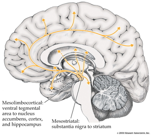

## Prelude

<iframe width="560" height="315" src="https://www.youtube.com/embed/lioWzrpCtGQ" frameborder="0" allowfullscreen></iframe>

## Prelude

<iframe width="420" height="315" src="https://www.youtube.com/embed/-2GmzyeeXnQ" frameborder="0" allowfullscreen></iframe>

## Announcements

- **Quiz 3 on Tuesday, 3/29**
- Go over Exam 2

## Today's Topics

- Bipolar disorder
- Schizophrenia

## Up/Down Documentary

<iframe width="560" height="315" src="https://www.youtube.com/embed/eyiZfzbgaW4" frameborder="0" allowfullscreen></iframe>

## Bipolar disorder

- Formerly “manic depression” or “manic depressive disorder
- Alternating mood states
    + Mania or hypomania (milder form)
    + Depression
- Cycles 3-6 mos in length, but
    + Rapid cycling (weeks or days)
- Suicide risk 20-60x normal population, [[@baldessarini_suicide_2006]](http://dx.doi.org/10.1017/S1092852900014681) 

## Symptoms

<http://www.nimh.nih.gov/health/topics/bipolar-disorder/index.shtml>

## Prevalence, subtypes

- 1-3% prevalence
- Subtypes
    + Bipolar I: manic episodes, possible depressive ones
    + Bipolar II: no manic episodes but hypomania + depression

## Genetics

- Overlap between bipolar disorder and schizophrenia
- Genes for voltage-gated Ca++ channels
    + Regulate NT, hormone release
    + Gene expression, cell metabolism
- [[@craddock_genetics_2013]](http://dx.doi.org/10.1016/S0140-6736(13)60855-7)

## Brain responses to emotional faces ≠ depression

[[@lawrence_subcortical_2004]](http://dx.doi.org/10.1016/j.biopsych.2003.11.017)

## [[@lawrence_subcortical_2004]](http://dx.doi.org/10.1016/j.biopsych.2003.11.017)

## [[@lawrence_subcortical_2004]](http://dx.doi.org/10.1016/j.biopsych.2003.11.017)

## Amyg, Hip volume reduced, 

[[@hallahan_structural_2011]](http://dx.doi.org/10.1016/j.biopsych.2010.08.029)

## [[@hallahan_structural_2011]](http://dx.doi.org/10.1016/j.biopsych.2010.08.029)

## Drug treatments

- Mood stabilizers
    + Lithium (Li)
    + Valproate (Depakote)
- Anticonvulsants
    + GABA agonists
    + Usually to treat epilepsy
    + e.g. lamotrigine (Lamictal)
- Antipsychotics

## Effects of Lithium

- Reduces mania, minimal effects on depressive states
- Increases/preserves PFC, hip, amyg volume
- downregulates DA, glu; upregulates GABA
- modulates 5-HT, NE
- [[@malhi_potential_2013]](http://dx.doi.org/10.1007/s40263-013-0039-0)

## An Unquiet Mind

## BP summed-up

- Changes in mood, but ≠ depression
- Genetic + environmental risk
- Changes in emotion processing network activity, size of hippocampus
- But, heterogeneous
- No simple link to a specific NT system

## Schizophrenia

<iframe width="420" height="315" src="https://www.youtube.com/embed/gGnl8dqEoPQ" frameborder="0" allowfullscreen></iframe>

## Simulating the Experience

<iframe width="420" height="315" src="https://www.youtube.com/embed/YXimT5CHCDE" frameborder="0" allowfullscreen></iframe>

## Overview

- Lifetime prevalence ~ 1/100
- 1/3 chronic & severe
- Onset post-puberty, early adulthood
- Pervasive disturbance in mood, thinking, movement, action, memory, perception

## Screening (Yale PRIME test)

1. I think that I have felt that there are odd or unusual things going on that I can’t explain.
2. I think that I might be able to predict the future.
3. I may have felt that there could possibly be something interrupting or controlling my thoughts, feelings, or actions. 

<http://www.schizophrenia.com/sztest/primetest.pdf>

## Screening (continued)

5. I get confused at times whether something I experience or perceive may be real or may be just part of my imagination or dreams. 
6. I have thought that it might be possible that other people can read my mind, or that I can read other’s minds.
7. I wonder if people may be planning to hurt me or even may be about to hurt me.

## Historical background

- Bleuler
    + Introduced “schizophrenia” or “split mind”
    + Not multiple personality disorder
- Kraeplin
    + Dementia Praecox and Paraphrenia (1919)
    + Emphasized developmental and hereditary origins

## "Positive" symptoms

- “Additions” to behavior
- Disordered thought
- Delusions of grandeur, persecution
- Hallucinations (usually auditory)
- Bizarre behavior

## "Negative" symptoms

- “Reductions” in behavior
- Poverty of speech
- Flat affect
- Social withdrawal
- Impaired executive function
- Anhedonia (loss of pleasure)
- Catatonia (reduced movement)

## Biological bases

- Genetic disposition
- Brain abnormalities
- Developmental origins

## Genetic disposition

## Ventricles larger, esp in males

## Hip and amyg smaller

- Related to ventricular enlargement?
- Early disturbance in brain development?

## Rapid gray matter loss in adolescents?

[[@thompson_mapping_2001]](http://dx.doi.org/10.1073/pnas.201243998)

## Dopamine hypothesis

## Evidence for DA hypothesis

- DA (D2 receptor) antagonists (e.g. chlorpromazine)
    + improve positive symptoms
- DA agonists
    + amphetamine, cocaine, L-DOPA
    + mimic or exacerbate symptoms

## Evidence against...

- New drugs 
    + (e.g. Clozapine) INCREASE DA in frontal cortex, affect 5-HT
- Mixed evidence for high DA metabolite levels in CSF
- Glutamate hypothesis
    + Underactivation of NMDA receptors?
    + NMDA receptor role in learning, plasticity

## Schizophrenia summed up

- Wide-ranging disturbance of mood, thought, action, perception
- Broad changes in brain structure, function, chemistry
- Genetic risk + environmental factors

## References {.smaller}