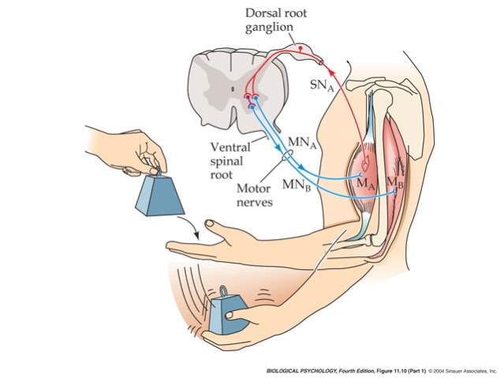
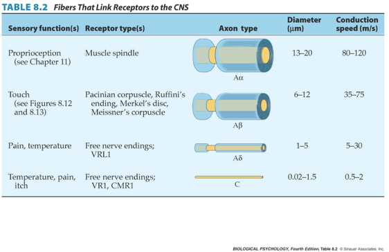

## Prelude

<iframe width="420" height="315" src="https://www.youtube.com/embed/L0CVoFsUhC4" frameborder="0" allowfullscreen></iframe>

## Prelude

<iframe width="420" height="315" src="https://www.youtube.com/embed/XaI5IRuS2aE" frameborder="0" allowfullscreen></iframe>

## Today's Topics

- The neuroscience of action

## The Real Reason for Brains

<iframe src="https://embed-ssl.ted.com/talks/daniel_wolpert_the_real_reason_for_brains.html" width="640" height="360" frameborder="0" scrolling="no" webkitAllowFullScreen mozallowfullscreen allowFullScreen></iframe>

## The neuroscience of action

- What types of actions are there?
- How are they produced?
    + By the muscles
    + By the nervous system
    
## Remember

- Nervous system "output" includes
    + Movements
    + Autonomic responses
    + Endocrine responses
    
## Types of actions

<http://www.kidport.com/reflib/science/humanbody/muscularsystem/images/Reflexes.jpg>

## Types of actions

- Reflexes
    + Simple, highly stereotyped, unlearned, rapid
- vs. Planned or voluntary actions
    + Complex, flexible, acquired, slower
- Discrete (reaching) vs. rhythmic (walking)
- Ballistic (no feedback) vs. controlled (feedback)

## Multiple, parallel controllers

## Key "nodes" in network

- Primary motor cortex (M1)
- Non-primary motor cortex
- Basal ganglia
- Brain stem
- Cerebellum
- Spinal cord

## Muscle classes

- Axial
    + Trunk, neck, hips
- Proximal
    + Shoulder/elbow, pelvis/knee
- Distal
    + Hands/fingers, feet/toes
    
## Muscles

<http://classroom.sdmesa.edu/eschmid/F08.12a.L.150.jpg>

## Muscle types

- Smooth
    + Arteries, hair follicles, uterus, intestines
    + Regulated by ANS (involuntary)
- Striated (striped)
    + Skeletal
    + Voluntary control, mostly connected to tendons and bones
- Cardiac

## Muscle types

<http://graphics8.nytimes.com/images/2007/08/01/health/adam/19917.jpg>

## How skeletal muscles contract

- Motoneuron (ventral horn of spinal cord)
- Neuromuscular junction
    + Releases ACh
    
## From spinal cord to muscle

    
## How skeletal muscles contract

- Motor endplate
    + Nicotinic ACh receptor
- Excitatory endplate potential
    + Muscle fibers depolarize
    + Depolarization spreads along fibers like an action potential
    + Sarcomeres are segments of fibers
    + Intramuscular stores release Ca++
    
## Motor endplate

## How skeletal muscles contract

- Myofibrils (w/in sarcomere)
    + Actin & mysosin proteins
    + “Molecular gears”
- Bind, move, unbind in presence of Ca++,  ATP

## Anatomy of muscle fibers

## Anatomy of motor endplate

## Muscle contraction

<iframe width="420" height="315" src="https://www.youtube.com/embed/Cjx3vSm54N8" frameborder="0" allowfullscreen></iframe>

## Agonist/antagonist muscle pairs

<http://2.bp.blogspot.com/-TpOC4my_NBc/T0J-MhEv29I/AAAAAAAAF88/dYLv7QzFwmg/s1600/Hamstring-Quad4.jpg>

## Meat preference?

## Muscle fiber types

- Fast twitch/fatiguing
    + Type II
    + White meat
- Slow twitch/fatiguing
    + Type I
    + Red meat
    
## Muscles are sensory organs, too!

## Two muscle fiber types

## Two muscle fiber types

- Extrafusal fibers
    + Generate force
    + ennervated by alpha ($\alpha$) motor neurons
- Intrafusal fibers
    + Sense length/tension
    + Contain muscle spindles linked to Ia afferents
    + ennervated by gamma ($\gamma$) motor neurons
    
## Monosynaptic stretch (myotatic) reflex

- Muscle stretched (length increases)
- Muscle spindle activates
- Ia afferent sends signal to spinal cord
    + Activates alpha ($\alpha$) motor neuron
- Muscle contracts, shortens length

## Monosynaptic stetch (myotatic) reflex

- Gamma ($\gamma$) motor neuron fires to take up intrafusal fiber slack

## Monosynaptic stretch (myotatic) reflex

## Why doesn't antagonist muscle respond?

## Why doesn't antagonist muscle respond?

- Polysynaptic inhibition of antagonist muscle
- Prevents/dampens tremor

## Brain gets fast(est) sensory info from spindles

## How the brain controls the muscles

- Pyramidal tracts
    + Pyramidal cells (Cerebral Cortex Layer 5) in primary motor cortex (M1)
    + Corticobulbar (cortex -> brainstem) tract
    + Corticospinal (cortex -> spinal cord) tract
- Crossover (decussate) in medulla
    + L side of brain ennervates R side of body
    
## Corticospinal tract

<https://commons.wikimedia.org/wiki/File:Gray764.png#/media/File:Gray764.png>

    
## How the brain controls the muscles

- Extrapyramidal system
    + Tectospinal tract
    + Vestibulospinal tract
    + Reticulospinal tract
- Involuntary movements
    + Posture, balance, arousal
    
## Extrapyramidal system

<https://upload.wikimedia.org/wikipedia/commons/b/be/Gray672.png>

## Disorders

- Parkinson's
- Huntington's

## Parkinson's

Maurice White, Musician

## The Faces of Parkinson's

<iframe width="560" height="315" src="https://www.youtube.com/embed/CqEwPqUO1Bw" frameborder="0" allowfullscreen></iframe>

## Parkinson's

- Slow, absent movement, resting tremor
- Cognitive deficits, depression
- DA Neurons in substantia nigra degenerate
- Treatments
    + DA agonists
    + DA agonists linked to impulse control disorders in ~1/7 patients [[@ramirez-zamora_treatment_2016]](http://dx.doi.org/10.1586/14737175.2016.1158103)
    + Levodopa (L-Dopa), DA precursor
    
## Awakenings

## Huntington's

<http://cp91279.biography.com/1000509261001/1000509261001_1733824754001_woody-guthrie-centennial-1.jpg>

## Huntington's

- Formerly Huntington’s Chorea
    + "Chorea" from Greek for "dance"
    + “Dance-like” pattern of involuntary movements
- Cognitive decline
- Genetic + environmental influences
- Disturbance in striatum
- No effective treatment

## Huntington's

<iframe width="560" height="315" src="https://www.youtube.com/embed/HBLrY_nXU_U" frameborder="0" allowfullscreen></iframe>

## Final thoughts

- Control of movement determined by multiple sources
- Cerebral cortex + basal ganglia + cerebellum + spinal circuits

## Multiple, parallel controllers

## Cerebellum as predictor of future sensory states? [[@ito_control_2008]](10.1038/nrn2332) {.smaller}

<http://venturebeat.com/wp-content/uploads/2009/10/star-trek-holodeck.jpg>

## Next time...

- Audition

## References {.smaller}
