## Prelude

<iframe width="420" height="315" src="https://www.youtube.com/embed/9hUy9ePyo6Q" frameborder="0" allowfullscreen></iframe>

## Today's Topics

- Wrap-up on [action](https://rawgit.com/psu-psychology/psych-260/master/lectures/260-2016-04-05.html#43)
- Auditory processing

## Auditory processing

- Goals
    + What's out there
    + Where is it?
- Sound
    + What is it?
- How the brain processes sound

## What is sound?

- Sound = pressure waves
- Vary in frequency, amplitude
- Requires a physical medium
- Works in the dark, over long distances, out of sight lines

## [Alien](https://en.wikipedia.org/wiki/Alien_(film))

<http://www.imamuseum.org/blog/wp-content/uploads/2012/07/movieposter-400x599.png>

## Detecting sound

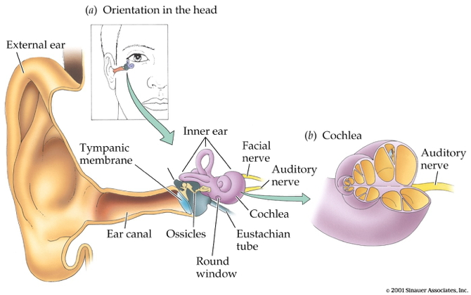

## Outer ear

- *Pinnae*
    + Filter sound
    + Channel sound
- *Ear canal*
    + Resonates to frequencies in speech
    
## Length, diameter determine resonant frequency

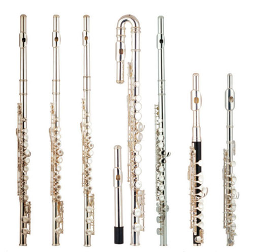

## Middle ear

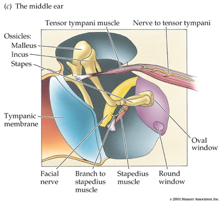

## Middle ear

- *Tympanic membrane*
- *Ossicles*
    + Malleus
    + Incus
    + Stapes
- *Middle Ear Muscles*
    + Stapedius & tensor tympani

## Where are we

## Function of ossicles, stapedius

- Ossicles amplify
    + Air thinner than cochlear fluid
- Muscles dampen
    + *Acoustic reflex* when sound intense or person vocalizes
    
## Inner ear

## Inner ear

- Oval window
- *Cochlea*
    + *Organ of Corti*
- Round window

## Organ of Corti

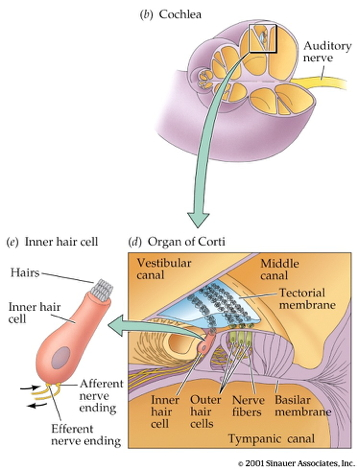

## Organ of Corti

- *Basilar membrane*
- *Tectorial membrane*
- *Hair cells*
- Cochlear fluid/endolymph

## Hair cells

- *Inner hair cells*
    + Transduce pressure waves
- *Outer hair cells*
    + “Fine tune” transduction 
    + Alter stiffness of basilar/tectorial membranes
    
## Otoacoustic emissions (OAE)

- Sounds made by the ear
    + Reflect integrity of hair cells
- Age of detection critical for early therapy

## Standing waves

<iframe width="420" height="315" src="https://www.youtube.com/embed/7xCmtYXewdk" frameborder="0" allowfullscreen></iframe>

## Cochlear movement

<iframe width="420" height="315" src="https://www.youtube.com/embed/TobHJt1jIHg" frameborder="0" allowfullscreen></iframe>

## CNS projections

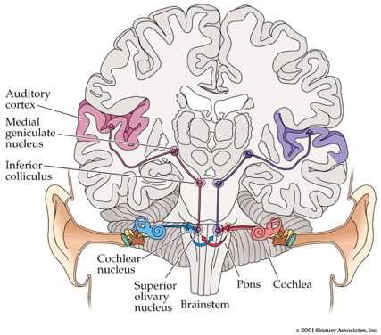

## CNS projections

- *Auditory nerve (8th/XIII cranial)*
- Cochlear nuclei
- Superior olivary nucleus
    + L & R ear inputs mix
- *Inferior colliculus*

## CNS projections

## CNS projections

- Thalamus
    + *Medial geniculate nucleus (MGN)*
- Temporal lobe 
    + *Auditory Cortex (AI)*
    
## Coding frequency

- Frequency ~ pitch
- Mixture of frequencies (timbre)
- *Place code*
    + Place on basilar membrane that vibrates most strongly

## Place code

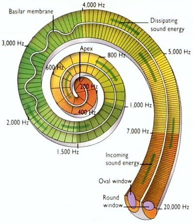

## Place code ~ xylophone

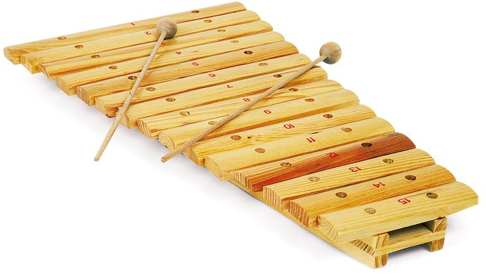

## *Tonotopy*

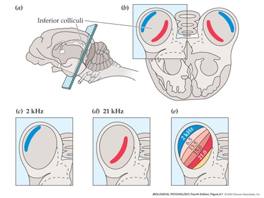

## Tonotopy in auditory cortex

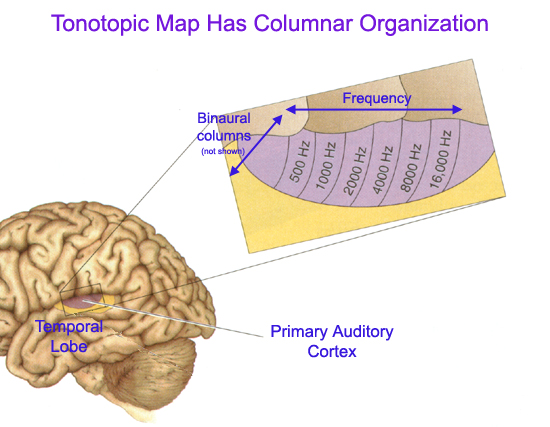

## Timbre

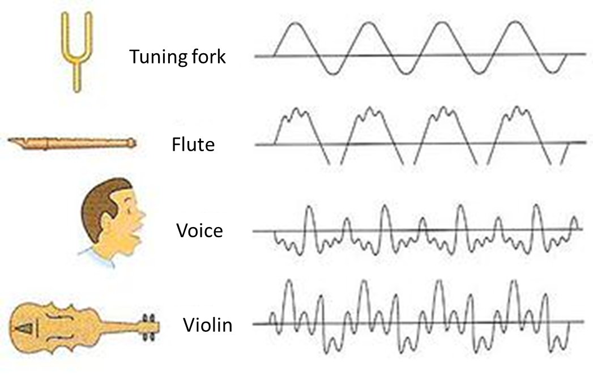

## Perceiving location

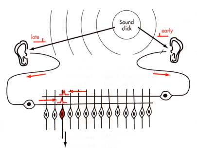

## Perceiving location

- Interaural (between the ears) time/phase differences
    + Low frequencies
- Interaural intensity differences
    + High frequencies
    
## How do we perceive sound elevation?

## Next time...

- Vision
