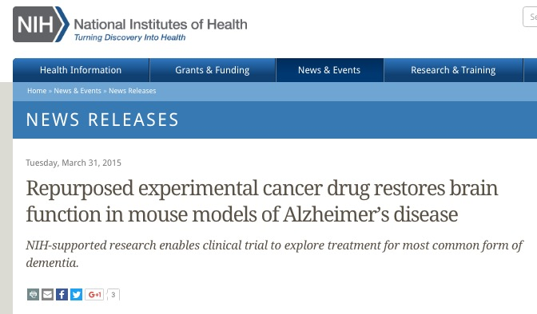
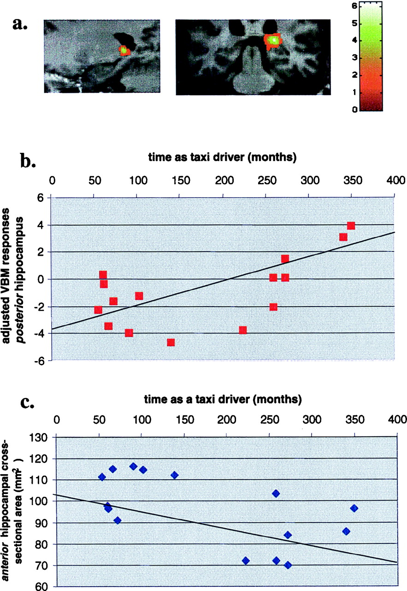

## Prelude

<iframe width="560" height="315" src="https://www.youtube.com/embed/ZrXrZ5iiR0o" frameborder="0" allowfullscreen></iframe>

## Today's Topics

- Quiz 4
- Special lecture
- Learning and memory
    + Alzheimer's Disease
    + Hippocampus

## Alzheimer's Disease (AD)

- Chronic, neurodegenerative disease affecting ~5 M Americans
- Cognitive dysfunction (memory loss, language difficulties, planning, coordination)
- Psychiatric symptoms and behavioral disturbances
- Difficulties with daily living
- [[@burns_alzheimers_2009]](http://doi.org/10.1136/bmj.b158)

## AD progression

[[@burns_alzheimers_2009]](http://doi.org/10.1136/bmj.b158)

## AD

- Post-mortem exams show beta amyloid plaques and neurofibrillary tangles

## AD

- Treatments include
    + Acetylcholinesterase (AChE) inhbitors (e.g. Aricept)
    + Glutamatergic partial antagonists (e.g., Memantine)
    
## New hope for treatment, [[@kaufman_fyn_2015]](http://doi.org/10.1002/ana.24394)

## Memory systems in the brain

[[@squire_memory_2004]](http://dx.doi.org/10.1016/j.nlm.2004.06.005)

## Hippocampus

<https://upload.wikimedia.org/wikipedia/commons/5/5b/Hippocampus_and_seahorse_cropped.JPG>

## Hippocampus features

- Dense in NMDA receptors
- Central "hub" in network
- [[@battaglia_hippocampus:_2011]](http://doi.org/10.1016/j.tics.2011.05.008)

## Hippocampus roles

- Formation, storage, consolidation of long-term episodic or declarative memories
- Stores info for later transfer to cortex
- Spatial navigation
    + [Place cells](https://en.wikipedia.org/wiki/Place_cell)
    + [Grid cells](http://www.scholarpedia.org/article/Grid_cells)
    + [Head-direction cells](http://www.scholarpedia.org/article/Head_direction_cells)

## Spatial precision of place cells

[[@kjelstrup_finite_2008]](http://dx.doi.org/10.1126/science.1157086)

## Human analogue -- [[@maguire2000navigation]](http://dx.doi.org/10.1073/pnas.070039597)

[[@maguire2000navigation]](http://dx.doi.org/10.1073/pnas.070039597)

## [[@maguire2000navigation]](http://dx.doi.org/10.1073/pnas.070039597)

[[@maguire2000navigation]](http://dx.doi.org/10.1073/pnas.070039597)

## [[@maguire2000navigation]](http://dx.doi.org/10.1073/pnas.070039597)

[[@maguire2000navigation]](http://dx.doi.org/10.1073/pnas.070039597)

## Hippocampal volume in food-caching birds

[[@sherry_hippocampal_1989]](http://dx.doi.org/10.1159/000116516)

## Main points

- Hippocampus "hub" in brain's storage of specific information about places, events, facts
- Damage to hippocampus or medial temporal lobe (MTL) region can impair formation of new memories

## Next time

- Review for Exam 4
- "The Cerebral Symphony"

## References {.smaller}
