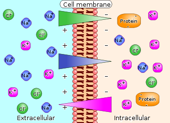

## Today's Topics

- Neurons
- How do neurons communicate?

## Structure of neurons

## [Dendrites](https://en.wikipedia.org/wiki/Dendrite)

- Branch-like "extrusions" from cell body
- Majority of input to neuron
- Cluster close to cell body/soma
- Usually receive info
- Passive (do not regenerate electrical signal) vs. active (regenerate signal)
- Spines

## [Dendrites](https://en.wikipedia.org/wiki/Dendrite)

## Dendritic Spines

## [Soma (cell body)](https://en.wikipedia.org/wiki/Soma_(biology))

- Varied shapes
- Nucleus
	+ Chromosomes
- Organelles
	+ Mitochonrdria
	+ Smooth and Rough Endoplasmic reticulum (ER)
	
## [Soma](https://en.wikipedia.org/wiki/Soma_(biology))

## [Axons](https://en.wikipedia.org/wiki/Axon)

- Another branch-like "extrusion" from soma
- Extend farther than dendrites
- Usually transmit info
- Parts
    + Initial segment (closest to soma, unmyelinated)
    + Nodes of Ranvier (unmyelinated segments along axon)
    + Terminals, axon terminals, terminal buttons, synaptic terminals, synaptic boutons

## Axons

## [Synaptic bouton (terminal button)](https://en.wikipedia.org/wiki/Axon_terminal)

- [Synapse](https://en.wikipedia.org/wiki/Chemical_synapse#Structure) (~5-10K per neuron) 
- Pre (sending cell) and postsynaptic (receiving cell) membranes
– Synaptic cleft -- space between cells
- [Synaptic vesicles](https://en.wikipedia.org/wiki/Synaptic_vesicle)
    + Pouches of neurotransmitters
- [Autoreceptors](https://en.wikipedia.org/wiki/Autoreceptor) (detect NTs); [transporters](https://en.wikipedia.org/wiki/Neurotransmitter_transporter) (transport NTs across membrane)

## [Synaptic bouton (terminal button)](https://en.wikipedia.org/wiki/Axon_terminal)

## Classifying neurons

- Functional role
    + Input (sensory), output (motor/secretory), interneurons 
- Anatomy
    + Unipolar
    + Bipolar
    + Multipolar
    
## Classifying neurons

- By specific anatomy
    + Pyramidal cells
    + Stellate cells 
    + Purkinje cells 
    + Granule cells

## Neurons by type

## Neural communication

- Electrical
    + Fast(er)
    + Within neurons
- Chemical
    + Slow(er)
    + Between neurons
    
## How are messages generated?

- Electrical potential (== voltage)
    + Think of potential energy
    + Voltage ~ pressure
    + Energy that will be released if something changes
    
## Potential energy

## Types of neural electrical potentials

- [Resting potential](https://en.wikipedia.org/wiki/Resting_potential)
- [Action potential](https://en.wikipedia.org/wiki/Action_potential)

## [Resting potential](https://en.wikipedia.org/wiki/Resting_potential)

- Measurement
    + Electrode on inside
    + Electrode on outside
    + Inside - Outside = potential
    
## [Resting potential](https://en.wikipedia.org/wiki/Resting_potential)

## [Resting potential](https://en.wikipedia.org/wiki/Resting_potential)

- Neuron (and other cells) have *potential energy*
    + Inside neuron is -60-70 mV, with respect to outside
    + About 1/20th typical AAA battery
- Like charges repel, opposites attract, so
    + Positively charged particles pulled in
    + Negatively charged particles pushed out
    
## Where does the resting potential come from?

- Ions
- Ion channels
- Separation between charges
- A balance of forces

## We are the champIONs, my friend

- Potassium, K+
- Sodium, Na+
- Chloride, Cl-
- Organic anions, A-

## Party On

- Annie (A-) was having a party.
    + Used to date Nate (Na+), but now sees Karl (K+)
- Hired bouncers called
    + "The Channels"
    + Let Karl and friends in or out, keep Nate out
- Annie's friends (A-) and Karl's (K+) mostly inside
- Nate and friends (Na+) mostly outside
- Claudia (Cl-) tagging along

## Party On

## Next time

- Neural communication

## References {.smaller}