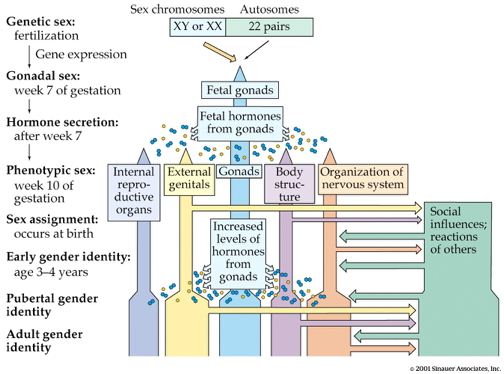
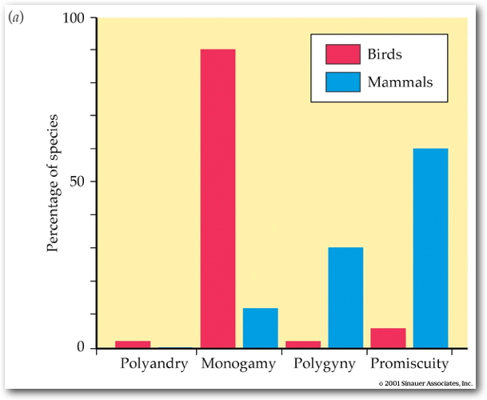

```{r setup, include=FALSE}
knitr::opts_chunk$set(echo = FALSE)
```

## Prelude

<iframe width="560" height="315" src="https://www.youtube.com/embed/vldh7oQD-a4" frameborder="0" allowfullscreen></iframe>

## Today's topics

- Wrap-up on hormones
- Your brain on sex

## Case 1: Reponses to threat or challenge

<div class="centered">

</div>

## Case 1: Responses to threat or challenge

- Neural response
    + *Sympathetic Adrenal Medulla (SAM) response*
    + Sympathetic NS activation of adrenal medulla, other organs
    + Releases NE and Epi

## Case 1: Responses to threat or challenge

- Endocrine response
    + *Hypothalamic Pituitary Adrenal (HPA) axis*
    + Adrenal hormones released
- Hypothalamus
    + *Corticotropin Releasing Hormone (CRH)*
- Anterior pituitary
    + *Adrenocorticotropic hormone (ACTH)*
    
## Case 1: Responses to threat or challenge

- Adrenal cortex
    + *Glucocorticoids (e.g., cortisol)*
    + *Mineralocorticoids (e.g. aldosterone)*

## Adrenal hormones

- *Steroids*
    + Derived from cholesterol
- *Cortisol*
    + increases blood glucose, anti-inflammatory
    + negative consequences of prolonged exposure 
- *Aldosterone*
    + Regulates Na (and water) retention in kidneys
    
## Case 2: Reproductive behavior -- the milk letdown reflex

- Hypothalamus releases oxytocin into posterior pituitary
- Targets milk ducts in breast tissue

## Milk letdown reflex

<div class="centered">
<a href="https://my.bpcc.edu/content/blgy225/Endocrine/Prolactin.jpg">

</a>
</div>

## Oxytocin's role

- Sexual arousal
- Released in bursts during orgasm
- Stimulates uterine, vaginal contraction
- Links to social interaction, bonding  [[@Weisman2013158]](http://dx.doi.org/10.1016/j.biopsych.2013.05.026)
- Alters face processing in autism  [[@Domes2013164]](http://dx.doi.org/10.1016/j.biopsych.2013.02.007)

## Oxytocin

<div class="centered">
<a href="http://columbusfreepress.com/sites/default/files/keep-calm-and-release-oxytocin-2(1).png">

</a>
</div>

## Sex and the brain

<iframe src="http://www.maryroach.net/bonk.html">
</iframe>

## What hormone is NOT released by the hypothalamus/pituitary system?

- Oxytocin
- Vasopressin
- Melatonin
- Adrenocorticotropic hormone (ACTH)

## What hormone is NOT released by the hypothalamus/pituitary system?

- Oxytocin
- Vasopressin
- Melatonin
- **Adrenocorticotropic hormone (ACTH)**

## Factors influencing sexual development

<div class="centered">

</div>

## Hormones have

- Organizing effects
    - Influence sexual development
- Activating effects
    - Influence sexual behavior
- But sexuality in humans is complex

## Types of mating systems

- Promiscuity (both -> multiple)
- Polyandry (female -> multiple males)
- Polygyny (male -> multiple females)
- Monogamy

## Mating systems

<div class="centered">

</div>

- Primates: 1/2 promiscuous (e.g., chimps); 1/3 polygynous (e.g., gorillas)

## Humans vs. most mammals...

- outward signs of estrous (i.e. higher body temperature, breast swelling, sugar cravings, etc.) less obvious
- copulate throughout the reproductive cycle, not just at estrous
- after ejaculation/orgasm in males and females, oxytocin release  has sedative effect
- sex in multiple positions
- couples live in large social groups

## Humans vs. most primates

- large relative size of testes, ejaculate volume, and sperm count vs. most primates;
- spend more time in copulation & copulate with greater frequency than other primates

## Cautionary notes

- Biology isn’t "destiny""
- “Natural” doesn’t mean morally right
- Human behavior shaped by biology AND culture

## Your brain and orgasm

<http://www.thevisualmd.com/read_videoguide.php?id_url=1033607627>

## Male and female brain *activity* patterns

- Before orgasm
    - Amygdala, fusiform gyrus deactivation
- During orgasm
    - Cerebellar activation
    - Lateral orbitofrontal cortex deactivates
    - Deactivation of amygdala, hippocampus
    - Periaqueductal grey (PAG) activates in men

## Male and female brain *structures* similar {.smaller}

<div class="centered">
<a href="http://doi.org/10.1073/pnas.1509654112">


[[@joel_sex_2015]](http://doi.org/10.1073/pnas.1509654112)
</div>

## Male and female brain *structures* similar {.smaller}

*Consistent with previous findings (14, 15), our analysis of the structure of the human brain, which included most regions of gray and white matter, as well as measures of connectivity, revealed many nondimorphic group-level sex/gender differences in brain structure. There was extensive overlap of the distributions of females and males for all brain regions and connections assessed, irrespective of the type of sample, measure, or analysis (including analysis of absolute brain volumes). This extensive overlap undermines any attempt to distinguish between a “male” and a “female” form for specific brain features...*

## But, different connectivity patterns?

<div class="centered">
<a href="http://doi.org/10.1073/pnas.1316909110">

</a>

[[@ingalhalikar_sex_2014]](http://doi.org/10.1073/pnas.1316909110)
</div>

## Different sizes in hypothalamic nuclei

- Sexually dimorphic nucleus of the hypothalamus
- Males >> females
- Controls male sexual behavior

## Venus vs. Mars?

<div class="centered">

</div>

----

<div class="centered">

</div>

## Next time...

- Sleep and circadian rhythms

## References {.smaller}


