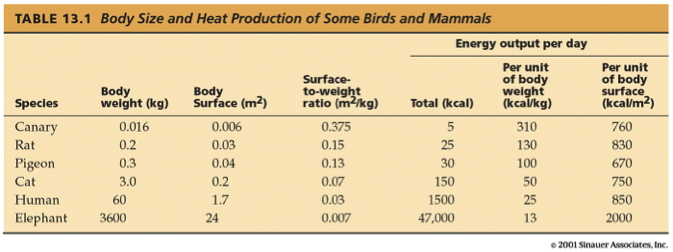
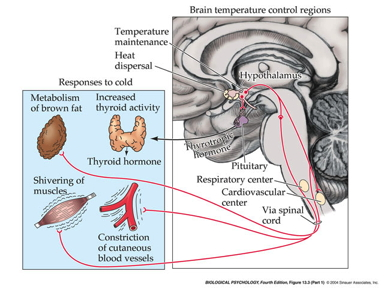
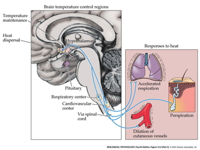
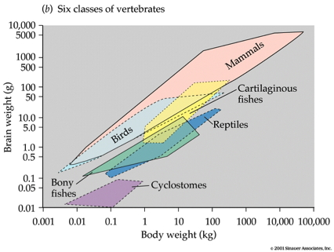
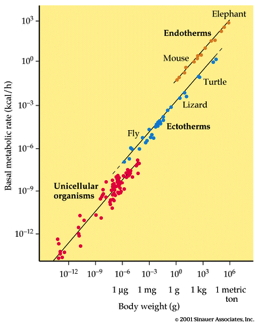
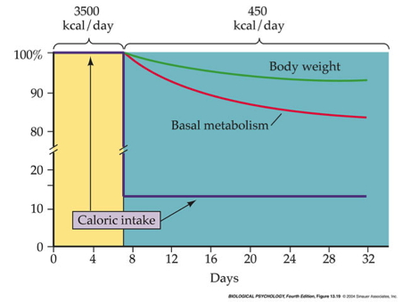
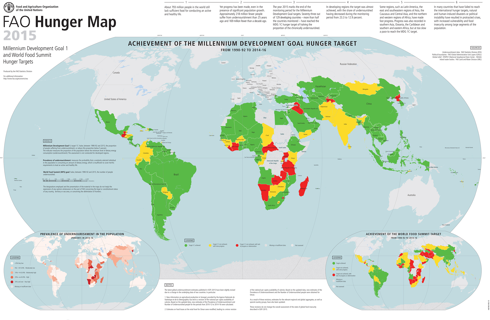

## Prelude

<iframe width="560" height="315" src="https://www.youtube.com/embed/nuM8kqayIrY" frameborder="0" allowfullscreen></iframe>

## Today's Topics

- **Exam 2** on Friday
- Extra point for mistake on Quiz 2, Question 9
- [Homeostasis](https://en.wikipedia.org/wiki/Homeostasis)

## What is homeostasis?

<iframe src="https://en.wikipedia.org/wiki/Homeostasis">
</iframe>

## Homeostatic mechanisms depend on negative feedback

## Domains

- Temperature
- Food intake/body mass

## Temperature regulation

----

## Temperature regulation

- Too cold: ice crystals disrupt cell membranes
- Too hot: molecular disruption

## Varieties of thermal regulation

| Regulation Type | Endothermic | Ectothermic |
|-----------------|-------------|-------------|
| Homeothermic    | Birds, mammals, some large fish | Tropical reptiles |
| Poikilothermic | Some birds, mammals | Most fish, amphibians, invertebrates |

## Ectothermy vs. endothermy

- Ectothermy
    + Behavioral regulation >> metabolic regulation
    + Older (evolutionarily-speaking), more species
    
----

----

## Ectothermy vs. endothermy

- Endothermy
    + Metabolic regulation > behavioral
    + Newer and fewer species

----

----

## Benefits/costs of endothermy

- Benefits
    + Sustained muscular activity?
    + Occupy more, more diverse ecological niches
    + Sociality, behavioral complexity?
- Costs
    + Metabolism
    + Food seeking
    + Body size

## Big bodies conserve heat; little ones lose it

- Heat produced ~ volume or mass (~ length^3)
- Heat loss ~ surface area (~ length^2)
- Big animals have >> volume/surface area ratio

----

----

----

----

<iframe width="560" height="315" src="https://www.youtube.com/embed/PJnn-wMPU9w" frameborder="0" allowfullscreen></iframe>

## [Bergman's rule](https://en.wikipedia.org/wiki/Bergmann%27s_rule)

----

## Inputs/outputs

- Inputs
    + Body temperature
    + External temperature
    + Brain (hypothalamus)
- Outputs
    + Autonomic/endocrine
    + Somatic/behavioral
    
## Control mechanisms

- **No single controller.**
- Responses to heating ≠ responses to cooling

----

## Response to heating

| Response Type | Response to Heating | Response to Cooling |
|---------------|---------------------|---------------------|
| Autonomic/endocrine | Vasodilation  | Piloerection        |
|                     | Sweating      | Increased fat metab |
| Somatic/behavioral  | Panting       | Shivering
|                     | Heat avoidance | Heat seeking       |
|                     |                | Huddling           |

----

----

## Control mechanisms

- Hypothalamus
    + Preoptic area (POA)
        - Autonomic response
    + Lateral hypothalamus
        - Behavioral responses
- Brain stem, spinal cord

----

----

## Big brains, big appetites

----

## Big brains/complex behavior related

- Why?

## Food seeking

- Grazing vs. gathering vs. hunting
- Quality vs. quantity
- Time/energy to find & consume
- Foraging theory: Maximize energy intake, minimize energy expenditure, per unit time.

## Just keeping the lights on...

- 60-70% daily calories -> basal metabolism
- 20% behavior
- 10% thermoregulation & digestion

## Why dieting is hard, often ineffective

----

----

<http://http://www.fao.org/hunger/en/>

## Next time...

- Review for Exam 2