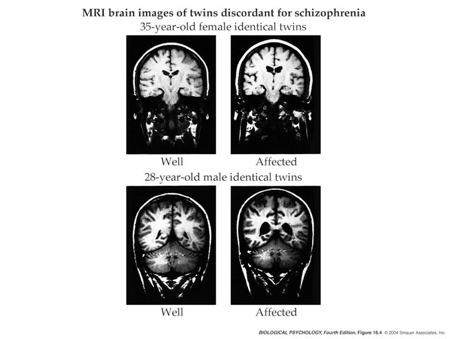

## Prelude

<iframe width="420" height="315" src="https://www.youtube.com/embed/-2GmzyeeXnQ" frameborder="0" allowfullscreen></iframe>

## Today's Topics

- Schizophrenia
- [Score distribution](grades/2016-10-20.png) (through Exam 2)
- **Exam 4** scheduled for Mon, Dec 12 10:10a, same room

## Schizophrenia

<iframe width="420" height="315" src="https://www.youtube.com/embed/gGnl8dqEoPQ" frameborder="0" allowfullscreen></iframe>

## Simulating the Experience

<iframe width="420" height="315" src="https://www.youtube.com/embed/YXimT5CHCDE" frameborder="0" allowfullscreen></iframe>

## Overview

- Lifetime prevalence ~ 1/100
- 1/3 chronic & severe
- Onset post-puberty, early adulthood
- Pervasive disturbance in mood, thinking, movement, action, memory, perception

## Screening (Yale PRIME test)

1. I think that I have felt that there are odd or unusual things going on that I can’t explain.
2. I think that I might be able to predict the future.
3. I may have felt that there could possibly be something interrupting or controlling my thoughts, feelings, or actions. 

<http://www.schizophrenia.com/sztest/primetest.pdf>

## Screening (continued)

5. I get confused at times whether something I experience or perceive may be real or may be just part of my imagination or dreams. 
6. I have thought that it might be possible that other people can read my mind, or that I can read other’s minds.
7. I wonder if people may be planning to hurt me or even may be about to hurt me.

## Historical background

- Bleuler
    + Introduced “schizophrenia” or “split mind”
    + Not multiple personality disorder
- Kraeplin
    + Dementia Praecox and Paraphrenia (1919)
    + Emphasized developmental and hereditary origins

## "Positive" symptoms

- “Additions” to behavior
- Disordered thought
- Delusions of grandeur, persecution
- Hallucinations (usually auditory)
- Bizarre behavior

## "Negative" symptoms

- “Reductions” in behavior
- Poverty of speech
- Flat affect
- Social withdrawal
- Impaired executive function
- Anhedonia (loss of pleasure)
- Catatonia (reduced movement)

## Biological bases

- Genetic disposition
- Brain abnormalities
- Developmental origins

## Genetic disposition

## Ventricles larger, esp in males

## Hip and amyg smaller

- Related to ventricular enlargement?
- Early disturbance in brain development?

## Rapid gray matter loss in adolescents?

[[@thompson_mapping_2001]](http://dx.doi.org/10.1073/pnas.201243998)

## Dopamine hypothesis

## Evidence for DA hypothesis

- DA (D2 receptor) antagonists (e.g. chlorpromazine)
    + improve positive symptoms
- DA agonists
    + amphetamine, cocaine, L-DOPA
    + mimic or exacerbate symptoms

## Evidence against...

- New drugs 
    + (e.g. Clozapine) INCREASE DA in frontal cortex, affect 5-HT
- Mixed evidence for high DA metabolite levels in CSF
- Glutamate hypothesis
    + Underactivation of NMDA receptors?
    + NMDA receptor role in learning, plasticity

## Schizophrenia summed up

- Wide-ranging disturbance of mood, thought, action, perception
- Broad changes in brain structure, function, chemistry
- Genetic risk + environmental factors

## Early life stress

<iframe src="http://www.psypost.org/2016/09/offspring-parents-babies-holocaust-worse-course-schizophrenia-44985">
</iframe>

## Next time...

- Bipolar disorder

## References {.smaller}