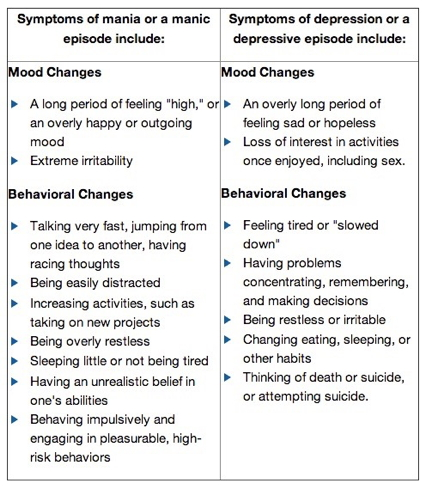

## Prelude

<iframe width="560" height="315" src="https://www.youtube.com/embed/lioWzrpCtGQ" frameborder="0" allowfullscreen></iframe>

## Today's Topics

- Bipolar disorder

## Up/Down Documentary

<iframe width="560" height="315" src="https://www.youtube.com/embed/eyiZfzbgaW4" frameborder="0" allowfullscreen></iframe>

## Bipolar disorder

- Formerly “manic depression” or “manic depressive disorder
- Alternating mood states
    + Mania or hypomania (milder form)
    + Depression
- Cycles 3-6 mos in length, but
    + Rapid cycling (weeks or days)
- Suicide risk 20-60x normal population, [[@baldessarini_suicide_2006]](http://dx.doi.org/10.1017/S1092852900014681) 

## Symptoms

<http://www.nimh.nih.gov/health/topics/bipolar-disorder/index.shtml>

## Prevalence, subtypes

- 1-3% prevalence
- Subtypes
    + Bipolar I: manic episodes, possible depressive ones
    + Bipolar II: no manic episodes but hypomania + depression

## Genetics

- Overlap between bipolar disorder and schizophrenia
- Genes for voltage-gated Ca++ channels
    + Regulate NT, hormone release
    + Gene expression, cell metabolism
- [[@craddock_genetics_2013]](http://dx.doi.org/10.1016/S0140-6736(13)60855-7)

## Brain responses to emotional faces ≠ depression

[[@lawrence_subcortical_2004]](http://dx.doi.org/10.1016/j.biopsych.2003.11.017)

## [[@lawrence_subcortical_2004]](http://dx.doi.org/10.1016/j.biopsych.2003.11.017)

## [[@lawrence_subcortical_2004]](http://dx.doi.org/10.1016/j.biopsych.2003.11.017)

## Amyg, Hip volume reduced, 

[[@hallahan_structural_2011]](http://dx.doi.org/10.1016/j.biopsych.2010.08.029)

## [[@hallahan_structural_2011]](http://dx.doi.org/10.1016/j.biopsych.2010.08.029)

## Drug treatments

- Mood stabilizers
    + Lithium (Li)
    + Valproate (Depakote)
- Anticonvulsants
    + GABA agonists
    + Usually to treat epilepsy
    + e.g. lamotrigine (Lamictal)
- Antipsychotics

## Effects of Lithium

- Reduces mania, minimal effects on depressive states
- Increases/preserves PFC, hip, amyg volume
- downregulates DA, glu; upregulates GABA
- modulates 5-HT, NE
- [[@malhi_potential_2013]](http://dx.doi.org/10.1007/s40263-013-0039-0)

## An Unquiet Mind

## BP summed-up

- Changes in mood, but ≠ depression
- Genetic + environmental risk
- Changes in emotion processing network activity, size of hippocampus
- But, heterogeneous
- No simple link to a specific NT system

## Next time...

- Depression

## References {.smaller}