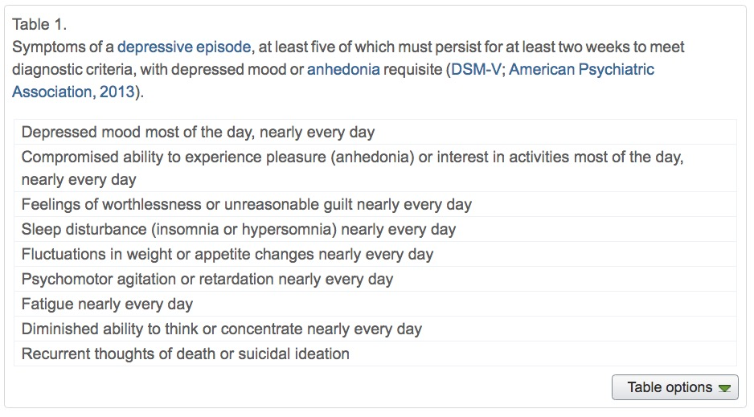
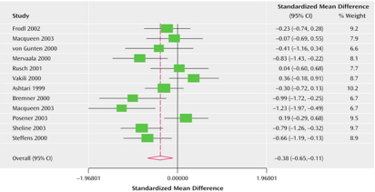
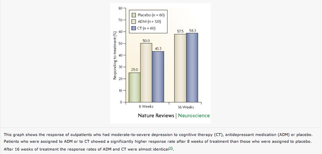

## Today's topic(s)

- Depression

## Major affective (emotional) disorders

- Types
    + Bipolar disorder
    + Depression
    + Anxiety
- Heritability
    + *proportion of variance in trait accounted for by genetic factors*
    + Monozygotic: .69
    + Dizygotic: .13
    
## Depression

- Symptoms
    + Insomnia, lethargy, loss of pleasure, interest, energy
- Agitation
- Lasting for several weeks or more
- Prevalence (up to ~20% lifetime)
- Females 2-3x males

## Symptoms, [[@mahar_stress_2014]](http://doi.org/10.1016/j.neubiorev.2013.11.009)

## Neurological factors

- Reduced hippocampal volumes
- [[@videbech2004hippocampal]](http://dx.doi.org/10.1176/appi.ajp.161.11.1957) meta-analysis
- Meta-analysis combines effects across many different studies

## [[@videbech2004hippocampal]](http://dx.doi.org/10.1176/appi.ajp.161.11.1957)

## [[@videbech2004hippocampal]](http://dx.doi.org/10.1176/appi.ajp.161.11.1957)

## Neurological factors

- Hypoactivity in
    + Frontal and temporal cortex
    + Anterior cingulate
    + Insula
    + Cerebellum
- [[@fitzgerald_meta-analytic_2008]](http://dx.doi.org/10.1002/hbm.20426)

## [[@fitzgerald_meta-analytic_2008]](http://dx.doi.org/10.1002/hbm.20426){.smaller}

(a) patients v. controls, (b) patients on SSRIs, (c) patients v. ctrls (happy stim), (d) patients v. controls (sad stim)

## Neurological Factors

- Persistent activation in amygdala
- Amygdala and dorsolateral prefrontal cortex (DLPFC) inversely related
- [[@siegle_cant_2002]](http://dx.doi.org/10.1016/S0006-3223(02)01314-8)

## Disrupted connectivity

- Resting state fMRI (rsFMRI) in 421 patients with major depressive disorder and 488 control subjects.
- Reduced connectivity between orbitofrontal cortex (OFC) and other areas of the brain
- Increased connectivity between lateral PFC and other brain areas

[[@cheng_medial_2016]](http://doi.org/10.1093/brain/aww255)

----

[[@cheng_medial_2016]](http://doi.org/10.1093/brain/aww255)

----

[[@cheng_medial_2016]](http://doi.org/10.1093/brain/aww255)

## Disturbed sleep

- Less slow wave (stage 3 and 4) 
- More REM earlier in night (typical is longer REM as night goes on)

## Pharmacological factors

- Endocrine
    + Lowered thyroid function
    + High/chronic cortisol levels
    
## Pharmacological factors

- Monoamine hypothesis
    + More: euphoria
    + Less: depression
    + Resperine (antagonist for NE & 5-HT) can cause depression
    + Low serotonin (5-HT) metabolite levels in CSF of suicidal depressives [[@samuelsson_csf_2006]](http://dx.doi.org/10.1111/j.1600-0447.2005.00639.x)
    
## [[@samuelsson_csf_2006]](http://dx.doi.org/10.1111/j.1600-0447.2005.00639.x)

## Treatments for depression

- Psychotherapy
    + Often effective when combined with drug treatment
- Drugs
- Exercise
- Electroconvulsive Shock (ECT)

## Drugs

- Monoamine oxidase (MAO) inhibitors
    + MAO destroys excess monoamines in terminal buttons
    + MAO-I’s boost monoamine levels
- Tricyclics
    + Inhibit NE, 5-HT reuptake
    + Upregulate monoamine levels, but non-selective = side effects
    
## Drugs

- Selective Serotonin Reuptake Inhibitors (SSRIs)
    + Fluoxetine (Prozac, Paxil, Zoloft)
    + Prolong duration 5-HT in synaptic cleft
    + Also increase brain steroid production
- Selective Serotonin Norepinephrine Reuptake Inhibitors (SNRIs)

## Cymbalta (SNRI)

<iframe width="420" height="315" src="https://www.youtube.com/embed/OTZvnAF7UsA" frameborder="0" allowfullscreen></iframe>

## How well do the drugs work?

- [STAR*D trial](http://www.nimh.nih.gov/funding/clinical-research/practical/stard/allmedicationlevels.shtml)
- On SSRI for 12-14 weeks. ~1/3 achieved remission; 10-15% showed symptom reduction.
- If SSRI didn't work, could switch drugs. ~25% became symptom free.
- 16% of participants dropped out due to tolerability issues
- Took 6-7 weeks to show response.

## Who will benefit from drug therapy?

- Depends on
    + Early life stress
    + Brain (amygdala) response to emotional faces
- [[@goldstein-piekarski_human_2016]](http://doi.org/10.1073/pnas.1606671113)
- Low-stress + low amyg reactivity -> > responding
- High stress + high amyg reactivity -> > responding

----

[[@goldstein-piekarski_human_2016]](http://doi.org/10.1073/pnas.1606671113)

## Problems with monoamine hypothesis

- Too simplistic
- NE, 5-HT interact
- Drugs fast acting (min), but improvement slow (weeks)

## What do drugs do, then?

- Receptor sensitivity altered?
    + Serotonin presynaptic autoreceptors compensate
    + Postsynaptic upregulation of NE/5-HT effects
- Stimulate neurogenesis?
    + Link to neurotrophin, brain-derived nerve growth factor (BDNF)
    + BDNF boosts neurogenesis

## Exercise as a treatment

[[@babyak2000exercise]](http://journals.lww.com/psychosomaticmedicine/Abstract/2000/09000/Exercise_Treatment_for_Major_Depression_.6.aspx)

## Drugs vs. therapy

[[@derubeis_cognitive_2008]](http://dx.doi.org/10.1038/nrn2345)

## [[@derubeis_cognitive_2008]](http://dx.doi.org/10.1038/nrn2345)

## [[@derubeis_cognitive_2008]](http://dx.doi.org/10.1038/nrn2345)

## [[@derubeis_cognitive_2008]](http://dx.doi.org/10.1038/nrn2345)

## Electroconvulsive Therapy (ECT)

- Last line of treatment for drug-resistant depression
- Remission rates of up to 50.9% [[@dierckx_efficacy_2012]](http://doi.org/10.1111/j.1399-5618.2012.00997.x)
- Seems to work via
    + Anticonvulsant (block Na+ channel or enhance GABA function) effects
    + Neurotrophic (stimulates neurogenesis) effects
    
## Neurogenesis hypothesis, [[@mahar_stress_2014]](http://doi.org/10.1016/j.neubiorev.2013.11.009)

- Chronic stress causes neural loss in hipp
- Chronic stress downregulates 5-HT sensitivity
- Depression ~ chronic stress
- Anti-depressants may upregulate neurogenesis via 5-HT modulation

## Depression's widespread impact

- Widespread brain dysfunction
- Prefrontal cortex, amygdala, HPA axis, circadian rhythms
- Genetic + environmental factors
- Disturbance in 5-HT, NE systems, cortisol
- Many sufferers do not respond to available treatments

## References {.smaller}
