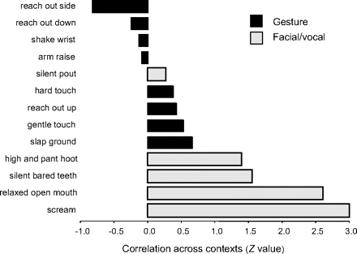
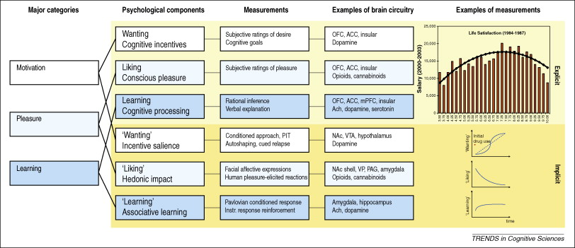

## Happiness Is...

<iframe width="560" height="315" src="https://www.youtube.com/embed/d13_LoHQkRM" frameborder="0" allowfullscreen></iframe>

## Today's Topics

- Biology of Emotion
- Happiness/pleasure
- Quiz 3 scheduled for Wednesday
    + Keep or push to Friday?

## Biology of Emotion

- What is emotion?
- What are the types of emotions?
- Biological systems involved in emotion

## What is emotion?

- Feelings
- Physiological state
- Actions
- Propensity to act

## What are the different types of emotions?

[[@plutchik1980emotion]](img/plutchik-wheel-emotion.png)

## Emotions

- Vary in valence
    + Positive/negative
- Vary in intensity (arousal)
- Vary in action tendency
    + Approach/avoid

## Emotions serve biological goals

- Ingestion
- Defense
- Reproduction

- Affiliation

## Plutchik

<http://puix.org/wp-content/uploads/plutchik-wheel-emotion.png>
[[@plutchik1980emotion]](img/plutchik-wheel-emotion.png)

## Biological goals served by

- Anger
- Fear
- Disgust
- Trust
- Sadness
- Happiness

## Do *all* emotions serve biological goals?

- Shame
- Guilt
- Pride
- Embarrassment
- Regret

## Are 'social' goals *biological*?

>- Darwinian view: 
    + If influence on reproductive outcomes, **yes**.

## Emotion <==> Cognition?

[@swanson2012brain]

## Emotion <==> Cognition?

[[@pessoa_relationship_2008]](http://dx.doi.org/10.1038/nrn2317)

## [[@pessoa_relationship_2008]](http://dx.doi.org/10.1038/nrn2317)

*Here, I will argue that complex cognitive–emotional behaviours have their basis in dynamic coalitions of networks of brain areas, none of which should be conceptualized as specifically affective or cognitive. Central to cognitive–emotional interactions are brain areas with a high degree of connectivity, called hubs, which are critical for regulating the flow and integration of information between regions.*

## Emotion as "computing"

- Input
- Processing/evaluation
- Output

## Emotion as "computing"

- **Input**
- Processing/evaluation
- Output

## Emotion as "computing"

- Input
    + External
    + Internal
    
## External Input

----

----

<audio controls>
<source src="snd/9999-ang-chk-a.wav" type="audio/wav">
</audio>
 
<audio controls>
<source src="snd/9999-hap-chk-a.wav" type="audio/wav">
</audio>

Cole, P., Gilmore, R.O., Scherf, K.S. & Perez-Edgar, K. (2016). The Proximal Emotional Environment Project (PEEP). Databrary. Retrieved October 31, 2016 from <https://nyu.databrary.org/volume/248>. 

----

Or food.

## Emotional "computing"

- Input
- **Processing/evaluation**

## Emotional "computing"

- Input
- Processing/evaluation
    + Current state + past states (memory)
    + Food/non
    + Threat/non
    + Mate/non; offspring/non

## Emotional "computing"

- Input
- Processing/evaluation
- **Output**

## Emotional "computing"

- Output
    + Physiological state
        * Autonomic nervous system
        * Hormones

## Emotional "computing"

- Output
    + Actions
        * Facial expression
        * Vocalization
        * Gestures, body posture
        * Locomotion or freezing

## Are non-human animals consistent in their use of emotion-expressing actions?

[[@pollick_ape_2007]](http://doi.org/10.1073/pnas.0702624104)

## Are different emotions processed differently in humans?

- Autonomic responses related to feelings
- Autonomic specificity: emotions autonomically unique vs. autonomically identical? [@levenson_autonomic_2003]

## Bodily maps of emotions

[[@nummenmaa2014bodily]](http://dx.doi.org/10.1073/pnas.1321664111)

[[@nummenmaa2014bodily]](http://dx.doi.org/10.1073/pnas.1321664111)

## [[@nummenmaa2014bodily]](http://dx.doi.org/10.1073/pnas.1321664111)

[[@nummenmaa2014bodily]](http://dx.doi.org/10.1073/pnas.1321664111)

## [[@nummenmaa2014bodily]](http://dx.doi.org/10.1073/pnas.1321664111)

>> *We propose that emotions are represented in the somatosensory system as culturally universal categorical somatotopic maps. Perception of these emotion-triggered bodily changes may play a key role in generating consciously felt emotions.*
    
## Biological systems involved in specific emotions

- Happiness

## Components of happiness

- [Aristotle](http://plato.stanford.edu/entries/aristotle-ethics/)
- Hedonia
    + Pleasure
- Eudaimonia
    + A life well-lived
    
## "Computing" happiness

- Inputs
    + External
    + Internal
- Processing
- Outputs
    + Feelings
    + Actions
    
## Neuroanatomy of happiness

[[@kringelbach2009towards]](http://dx.doi.org/10.1016/j.tics.2009.08.006)

## Neuroanatomy of happiness

[[@kringelbach2009towards]](http://dx.doi.org/10.1016/j.tics.2009.08.006)

## Rewards

- A *reward* reinforces (makes more prevalent/probable) some behavior
- Milner and Olds [[@milner_discovery_1989]](http://doi.org/10.1016/S0149-7634(89)80013-2) discovered 'rewarding' power of electrical self-stimulation
- [[@heath1963electrical]](http://doi.org/10.1176/ajp.120.6.571) studied effects in human patients.

## Electrical self-stimulation

<iframe width="420" height="315" src="https://www.youtube.com/embed/de_b7k9kQp0" frameborder="0" allowfullscreen></iframe>

## "Reward" circuitry in the brain

[[@nestler2006mesolimbic]](http://dx.doi.org/10.1016/j.biopsych.2005.09.018)

## Nodes in the "reward" circuit

- Ventral tegmental area (VTA)
- Nucleus accumbens (nAcc)
- Hypothalamus (Hyp)
- Amygdala (Amy)
- Hippocampus (HP)
- Dorsal Raphe Nucleus/Locus Coeruleus (DR/LC)
- Prefrontal cortex (PFC)

## Nucleus accumbens and dorsal striatum

[[@kohls2012social]](http://dx.doi.org/10.1186/1866-1955-4-10)

## Psychopharmacology of 'happiness'

- Dopamine
- Opioids
- Cannabinoids
- Serotonin, Norepinephrine
- ACh

## Endogenous opioids (endorphins) from hyp, NST

[[@clapp-niaa]](http://pubs.niaaa.nih.gov/publications/arh314/310-339.htm)

## Endogenous cannabinoid system

- CB1 receptors in CNS; CB2 in body, immune system

[[@flores_cannabinoid-hypocretin_2013]](http://dx.doi.org/10.3389/fnins.2013.00256)

## ACh projections in the CNS

[[@cock_sleep_2008]](http://dx.doi.org/10.1038/ncpneuro0775)

## Generalizations about happiness/pleasure

- Types of pleasure activate overlapping areas
- Pleasure/happiness engage a network of brain areas
- Pleasure/happiness signaling involves multiple neuromodulators, but DA especially important
- “Reward” pathway activated by many different inputs.

## Next time

- Fear
- Stress

## References {.smaller}
