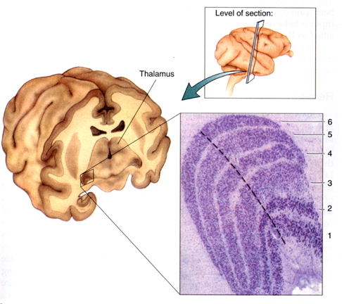
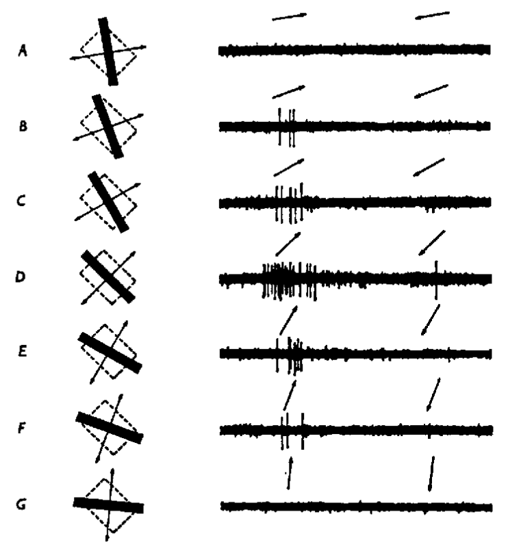

## Prelude

<iframe width="560" height="315" src="https://www.youtube.com/embed/x76VEPXYaI0" frameborder="0" allowfullscreen></iframe>

## Today's topics

- Wrap up on [the eye](https://rawgit.com/psu-psychology/psych-260/master/lectures/260-2016-11-28.html#36)
- From eye to brain

## Announcements

- Quiz 4 this Friday, 12/2
- Review Exam 3
- Exam 4 on Monday, 12/12 10:10a

## From eye to brain

## From eye to brain

- Retinal ganglion cells
- 2nd/II cranial (optic) nerve
    + Optic chiasm
- *Lateral Geniculate Nucleus (LGN)* of thalamus (90% of projections)

## From eye to brain

- Hypothalamus
    + Suprachiasmatic n.
- Superior colliculus & brainstem

## LGN

## LGN

- 6 layers + intralaminar zone
    + Parvocellular (small cells): chromatic 
    + Magnocellular (big cells): achromatic
    + Koniocellular (chromatic - short wavelength?)
- Retinotopic map of opposite visual field

## From LGN to V1

## From LGN to V1

- Via optic radiations
- *[Primary visual cortex (V1)](http://www.scholarpedia.org/article/Area_V1)* in occipital lobe

## Human V1

<http://www.scholarpedia.org/w/images/3/3a/03-Human-V1.png>

## Measuring retinotopy in V1

[[@dougherty_visual_2003]](http://dx.doi.org/10.1167/3.10.1)

## Retinotopy in V1

- Fovea overrepresented
    + Analogous to somatosensation
    + High acuity in fovea vs. lower outside it
- Upper visual field/lower (ventral) V1 and *vice versa*

## V1 has laminar, columnar organization

## V1 has laminar, columnar organization

- 6 laminae (layers)
    + Input: Layer 4
    + Output: Layers 2-3 (to cortex), 5 (to brainstem), 6 (to LGN)

## V1 has laminar, columnar organization

- Columns
    + Orientation/angle
    + Spatial frequency
    
## Orientation/angle tuning {.smaller}

<https://foundationsofvision.stanford.edu/wp-content/uploads/2012/02/dir.selective.png>

## From center-surround receptive fields to line detection {.smaller}

## Spatial frequency tuning

[[@panichello_predictive_2013]](http://dx.doi.org/10.3389/fpsyg.2012.00620)

## V1 has laminar, columnar organization

- Columns
    + Color/wavelength
    + Eye of origin, *ocular dominance*
    
## Ocular dominance columns

## Ocular dominance signals retinal disparity

<iframe width="560" height="315" src="https://www.youtube.com/embed/KjAQdc29vF8" frameborder="0" allowfullscreen></iframe>

<http://www.scholarpedia.org/w/images/9/99/11-Hubel-Wiesel-model.png>

## Beyond V1

## Beyond V1

- Larger, more complex receptive fields
- *Dorsal stream* (where/how)
    + Toward parietal lobe
- *Ventral stream* (what)

## What is vision for?

- What is it? (form perception)
- Where is it? (space perception)
- How do I get from here to there (action control)
- What time (or time of year) is it?

## Next time

- Quiz 4
- Exam 3 returned

## References {.smaller}
