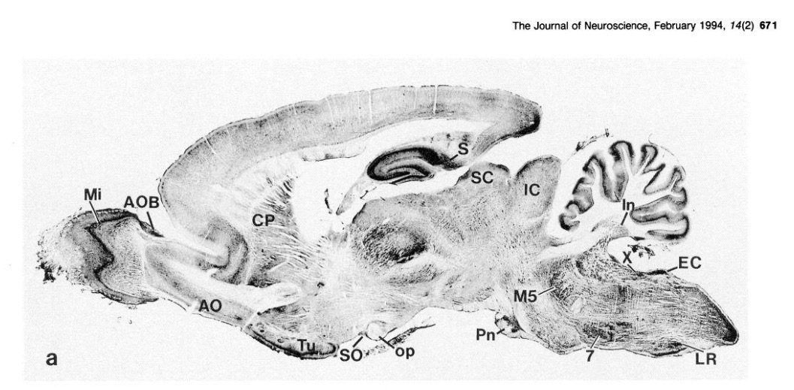

## Prelude

<iframe width="420" height="315" src="https://www.youtube.com/embed/nSz16ngdsG0" frameborder="0" allowfullscreen></iframe>

## Prelude

<iframe width="420" height="315" src="https://www.youtube.com/embed/4-L6rEm0rnY" frameborder="0" allowfullscreen></iframe>

## Announcements

- **Exam 4 next Monday, 12/12, 10:10a**

## Today's Topics

- Learning and memory

## Electronic (computer) memory

>- Random Access Memory (RAM) vs. disk memory
>- Different types of info (text, images, video, sounds, data)
>- Each item has a specific location/address
>- Memory doesn't erase unless i) written over, or ii) hardware failure
>- Store once, retrieve many times

----

[[@fischetti2011computers]](https://www.scientificamerican.com/article/computers-vs-brains/)

## Memory capacity of the human brain?

- 1e11 neurons
- 1e3 synapses/neuron
- 1e14 synapses or 1.25e13 bytes
- 1e9 gigabyte, 1e12 terabyte, 1e15 petabyte

<http://www.scientificamerican.com/article.cfm?id=what-is-the-memory-capacity>

## What is learning and memory anyway?

- Learning
    + ?
- Memory
    + ?
    
## How do you known when you've

- Learned?
- Remembered?

## What is learning and memory anyway?

- Learning
    + Change in perception, thought, behavior, emotion over time
- Memory
    + Information derived from past experience that influences current behavior
    
## Biological basis of L&M?

- Changes in how neurons respond
- Changes in patterns of neural activity
    + Neurons A-D vs. C-G
- Changes in patterns of connectivity
    + New synapses
    + Changes in synaptic strength (+/-)
    
## How do synapses change strength?

## Donald Hebb's Insight

*When an axon of cell A is near enough to excite cell B and repeatedly or persistently takes part in firing it, some growth process or metabolic change takes place in one or both cells such that A’s efficacy, as on of the cells firing B, is increased.* (Hebb, 1949, p. 62)

----

*Neurons that fire together wire together.* (Lowell & Singer, 1992, p. 211).

## NMDA receptor (NMDA-R) and *'Hebbian' learning*

- Named for N-methyl-D-asparate, selective agonist
- Coincidence detector
    + Sending cell has released NT (glu)
    + Receiving cell is/has been recently active (depolarized)
    
## NMDA-R

- Chemically-gated
    + Ligand- (glutamate + glycine or D-serine co-factor) gated
- Voltage-gated
    + Mg++/Zn++ ion 'plug' removed under depolarization

## NMDA receptor figure

<https://upload.wikimedia.org/wikipedia/commons/thumb/0/00/Activated_NMDAR.svg/220px-Activated_NMDAR.svg.png>

## Drug influences on NMDA-Rs

- Phencyclidine (PCP)
    + NMDA-R antagonist
    + schizophrenia-type symptoms
    + Glutamate hypothesis of schizophrenia
- Alcohol
- Anesthetics: ketamine, nitrous oxide (NO)

----

- Memantine
    + NMDA-R antagonist
    + treatment for moderate to severe Alzheimer's disease
    + reduces effects of glutamate excitotoxicity?

## NMDA-R distribution

[@petralia1994light]

## NMDA receptors contribute to associative learning

- Associate (link)
    + Concept A -> Concept B
    + Neuron A -> Neuron B
    
## Mind maps, e.g., [Mindmup](http://www.mindmup.com)

## Donald

## Donald

- Trump
- Duck
- Draper

## [Long-term potentiation (LTP)](https://en.wikipedia.org/wiki/Long-term_potentiation) {.smaller}

<https://upload.wikimedia.org/wikipedia/commons/thumb/b/b9/LTP_exemplar.jpg/800px-LTP_exemplar.jpg>

## Long-term potentiation (LTP)

- Long-term increase in synaptic strength based on recent activity.

## Spike-timing-dependent plasticity

[[@caporale2008spike]](http://dx.doi.org/10.1146/annurev.neuro.31.060407.125639)

   
## Spike-timing-dependent plasticity

[[@caporale2008spike]](http://dx.doi.org/10.1146/annurev.neuro.31.060407.125639)

## Spike-timing-dependent plasticity

- A before B: strengthen A->B
- A after B: weaken A->B
- [*Neural Plasticity*](https://en.wikipedia.org/wiki/Neuroplasticity)
    + Lasting hanges in neural firing, connectivity
- NMDA receptor molecular mechanism for implementing LTP and spike-timing-dependent plasticity

## How does LTP work?

- Ca++ entry triggers biochemical cascade
- Existing (AMPA) glutamate receptors made to stay open longer
- New AMPA Glu receptors synthesized, inserted into postsynaptic membrane

## LTP signaling {.smaller}

<http://thebrain.mcgill.ca/flash/a/a_07/a_07_m/a_07_m_tra/a_07_m_tra.html>

## Next time...

- Amnesia
- The hippocampus

## References {.smaller}