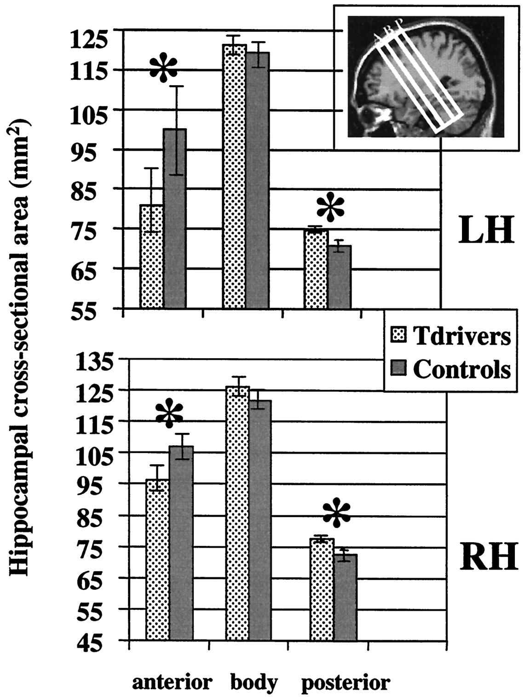
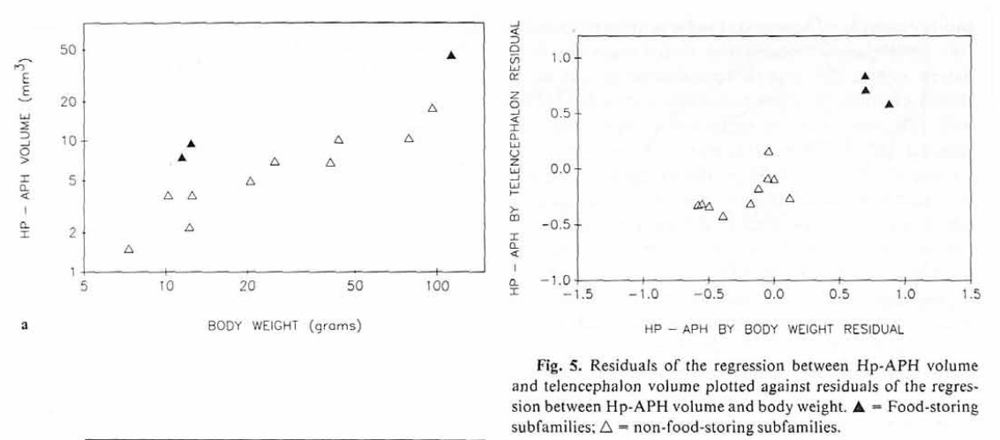

## Announcements

- Review for Exam 4 on Friday
- Exam 4, Monday 10:10a

## Today's Topics

- LTP
- Patient HM
- Alzheimer's Disease
- Hippocampus

## How does LTP work?

- Sending cell Glu release + Receiving cell depolarize = NMDA opens
- Ca++ entry triggers biochemical cascade
    + Protein Kinase C (PKC) and Ca2+/calmodulin-dependent protein kinase (CaMKII) *phosphorylate* (add a phospate group) to AMPA receptors
    + AMPA receptors stay open longer, stronger EPSPs
- Longer term: new AMPA Glu receptors synthesized, inserted into postsynaptic membrane

## LTP signaling {.smaller}

<http://thebrain.mcgill.ca/flash/a/a_07/a_07_m/a_07_m_tra/a_07_m_tra.html>

## Dimensions of stored info

- Memory of what?
    + Facts/events/places vs. skills
- Memory of when?
    + Immediate vs. distant past
- Memory for how long?
    + Seconds vs. years

## Memory systems in the brain

[[@squire_memory_2004]](http://dx.doi.org/10.1016/j.nlm.2004.06.005)

## Summary thus far

- Learning and memory involve changes in neural firing, circuitry
- Hebbian learning a type of associative learning
- NMDA receptor as coincidence detector
    + Molecular basis of one form of long-term potentiation (LTP)
- Different types of information stored in different brain systems

## Disorders of memory

## [Patient HM](http://www.pbs.org/wgbh/nova/body/corkin-hm-memory.html) (Henry G. Molaison)

- Intractable/untreatable epilepsy
- Bilateral resection of medial temporal lobe (1953)
- Epilepsy now treatable
- But, memory impaired
- Lived until 2008

## Brenda Milner tells the story

<iframe width="560" height="315" src="https://www.youtube.com/embed/JliczINA__Y" frameborder="0" allowfullscreen></iframe>

## HM's surgery

## Amnesia

- Acquired loss of memory
- ≠ normal forgetting
- Note: computers don't forget

## HM's amnesia

- **Retrograde amnesia**
    + Can’t remember 10 yrs before operation
    + Distant past better than more recent
- Severe, global **anterograde amnesia**
    + Impaired learning of new facts, events, people
- But, skills (mirror learning) intact
    
## Types of amnesia

- Retrograde ('backwards' in time)
    + Damage to information acquired pre-injury
    + Temporally graded
- Anterograde ('forward' in time) 
    + Damage to information acquired/experienced post-injury

## What it's like

*Every day is alone in itself, whatever enjoyment I’ve had, and whatever sorrow I’ve had…Right now, I’m wondering, have I done or said anything amiss?  You see at this moment, everything looks clear to me, but what happened just before?  That’s what worries me.  It’s like waking from a dream.  I just don’t remember.*

## What it's like

<iframe width="560" height="315" src="https://www.youtube.com/embed/Rq9eM4ZXRgs" frameborder="0" allowfullscreen></iframe>
    
## Other causes of amnesia

- Disease 
    + Alzheimer’s, herpes virus
- [Korsakoff’s syndrome](https://en.wikipedia.org/wiki/Korsakoff%27s_syndrome)
    + Result of severe alcoholism
    + Impairs medial thalamus & mammillary bodies

## Patient NA

- Fencing accident
- Damage to medial thalamus
- Anterograde + graded retrograde amnesia
- Are thalamus & medial temporal region connected?

## Patient NA

<iframe width="420" height="315" src="https://www.youtube.com/embed/1GfFopZSyj8" frameborder="0" allowfullscreen></iframe>

## Spared skills in amnesia

- Skill-learning
- Mirror-reading, writing
- Short-term memory
- “Cognitive” skills
- Priming

## What does amnesia tell us?

- Long-term memory for facts, events, people 
- ≠ Short-term memory
- ≠ Long-term memory for “skills”
- Separate memory systems in the brain?

## Memory systems in the brain

[[@squire_memory_2004]](http://dx.doi.org/10.1016/j.nlm.2004.06.005)

## Alzheimer's Disease (AD)

- Chronic, neurodegenerative disease affecting ~5 M Americans
- Cognitive dysfunction (memory loss, language difficulties, planning, coordination)
- Psychiatric symptoms and behavioral disturbances
- Difficulties with daily living
- [[@burns_alzheimers_2009]](http://doi.org/10.1136/bmj.b158)

## AD progression

[[@burns_alzheimers_2009]](http://doi.org/10.1136/bmj.b158)

## AD

- Post-mortem exams show beta amyloid plaques and neurofibrillary tangles

## AD

- Treatments include
    + Acetylcholinesterase (AChE) inhibitors (e.g. Aricept)
    + Glutamatergic (NMDA) partial antagonists (e.g., Memantine)
    
## New hope for treatment, [[@kaufman_fyn_2015]](http://doi.org/10.1002/ana.24394)

## Hippocampus

<https://upload.wikimedia.org/wikipedia/commons/5/5b/Hippocampus_and_seahorse_cropped.JPG>

## Hippocampus features

- Dense in NMDA receptors
- Central "hub" in network
- [[@battaglia_hippocampus:_2011]](http://doi.org/10.1016/j.tics.2011.05.008)

## Hippocampus roles

- Formation, storage, consolidation of long-term episodic or declarative memories
- Stores info for later transfer to cortex
- Spatial navigation
    + [Place cells](https://en.wikipedia.org/wiki/Place_cell)
    + [Grid cells](http://www.scholarpedia.org/article/Grid_cells)
    + [Head-direction cells](http://www.scholarpedia.org/article/Head_direction_cells)

## Spatial precision of place cells

[[@kjelstrup_finite_2008]](http://dx.doi.org/10.1126/science.1157086)

## Human analogue -- [[@maguire2000navigation]](http://dx.doi.org/10.1073/pnas.070039597)

[[@maguire2000navigation]](http://dx.doi.org/10.1073/pnas.070039597)

## [[@maguire2000navigation]](http://dx.doi.org/10.1073/pnas.070039597)

[[@maguire2000navigation]](http://dx.doi.org/10.1073/pnas.070039597)

## [[@maguire2000navigation]](http://dx.doi.org/10.1073/pnas.070039597)

[[@maguire2000navigation]](http://dx.doi.org/10.1073/pnas.070039597)

## Hippocampal volume in food-caching birds

[[@sherry_hippocampal_1989]](http://dx.doi.org/10.1159/000116516)

## Main points

- Hippocampus "hub" in brain's storage of specific information about places, events, facts
- Damage to hippocampus or medial temporal lobe (MTL) region can impair formation of new memories

## References {.smaller}