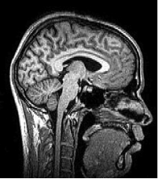

## The image illustrates what type of slice?

## The image illustrates what type of slice?

 - Sagittal
 - Horizontal
 - Coronal
 - Axial

## The image illustrates what type of slice?

 - **Sagittal**
 - Horizontal
 - Coronal
 - Axial

## All of the following structures can be seen in the figure EXCEPT

- Cerebellum
- Corpus callosum
- Lateral ventricles
- Cerebral cortex

## All of the following structures can be seen in the figure EXCEPT

- Cerebellum
- Corpus callosum
- **Lateral ventricles**
- Cerebral cortex

## The figure illustrates which imaging method?

- CT
- PET
- Magnetoencephalography (MEG)
- MRI

## The figure illustrates which imaging method?

- CT
- PET
- Magnetoencephalography (MEG)
- **MRI**

## Descartes thought that this structure was the place where the soul influenced the human body's voluntary movements.

- The pons
- The pituitary gland
- The pineal gland
- The reflexive complex

## Descartes thought that this structure was the place where the soul influenced the human body's voluntary movements.

- The pons
- The pituitary gland
- **The pineal gland**
- The reflexive complex

## The tongue is _____ with respect to the nose.

- Ventral
- Superior
- Dorsal
- Medial

## The tongue is _____ with respect to the nose.

- **Inferior**
- Superior
- Dorsal
- Medial

## Auditory information enters the CNS via the 8th (VIII) cranial nerve and projects through this sound-responsive nucleus of the midbrain tectum.

- lateral geniculate nucleus
- striatum
- substantia nigra
- inferior colliculus

## Auditory information enters the CNS via the 8th (VIII) cranial nerve and projects through this sound-responsive nucleus of the midbrain tectum.

- lateral geniculate nucleus
- striatum
- substantia nigra
- **inferior colliculus**

## Neural degeneration in this midbrain structure is associated with Parkinson’s Disease.

- hypothalamus
- substantia nigra
- insula
- amygdala

## Neural degeneration in this midbrain structure is associated with Parkinson’s Disease.

- hypothalamus
- **substantia nigra**
- insula
- amygdala

## Electroencephalography (EEG) has _____ temporal resolution than functional MRI, but _____ spatial resolution.

- better; similar
- better; worse
- worse; better
- worse; similar

## Electroencephalography (EEG) has _____ temporal resolution than functional MRI, but _____ spatial resolution.

- better; similar
- **better; worse**
- worse; better
- worse; similar

## Which of these landmarks separates the frontal from the parietal lobe?

- Lateral fissure
- Longitudinal fissure
- Anterior cingulate gyrus
- Central sulcus

## Which of these landmarks separates the frontal from the parietal lobe?

- Lateral fissure
- Longitudinal fissure
- Anterior cingulate gyrus
- **Central sulcus**

## Gray matter is mainly composed of:

- Axons
- Cell bodies
- Myelin
- None of the above

## Gray matter is mainly composed of:

- Axons
- **Cell bodies**
- Myelin
- None of the above

## Which of these is NOT a component of the forebrain?

- Cerebral cortex
- Basal ganglia
- Hypothalamus
- Medulla

## Which of these is NOT a component of the forebrain?

- Cerebral cortex
- Basal ganglia
- Hypothalamus
- **Medulla**

## Which brain lobe contains the primary and supplementary motor cortex?

- Frontal
- Temporal
- Parietal
- Occipital 

## Which brain lobe contains the primary and supplementary motor cortex?

- **Frontal**
- Temporal
- Parietal
- Occipital

## During a threatening situation signals are sent through the amygdala to what brain structure that controls the ANS and the endocrine/hormal processes?

- Hippocampus
- Thalamus
- Hypothalamus
- Basal Ganglia

## During a threatening situation signals are sent through the amygdala to what brain structure that controls the ANS and the endocrine/hormal processes?

- Hippocampus
- Thalamus
- **Hypothalamus**
- Basal Ganglia

## Which of these of techniques relays on the hemodynamic response function in order to draw conclusions about brain activity?

- fMRI
- PET
- Ca++ Imaging
- EEG

## Which of these of techniques relays on the hemodynamic response function in order to draw conclusions about brain activity?

- **fMRI**
- PET
- Ca++ Imaging
- EEG

## What is the name of the area in the brain at the brainstem where the blood/brain barrier is thin?

- Tectum
- Area Postrema
- Medulla Oblongata
- Tegmentum

## What is the name of the area in the brain at the brainstem where the blood/brain barrier is thin?

- Tectum
- **Area Postrema**
- Medulla Oblongata
- Tegmentum